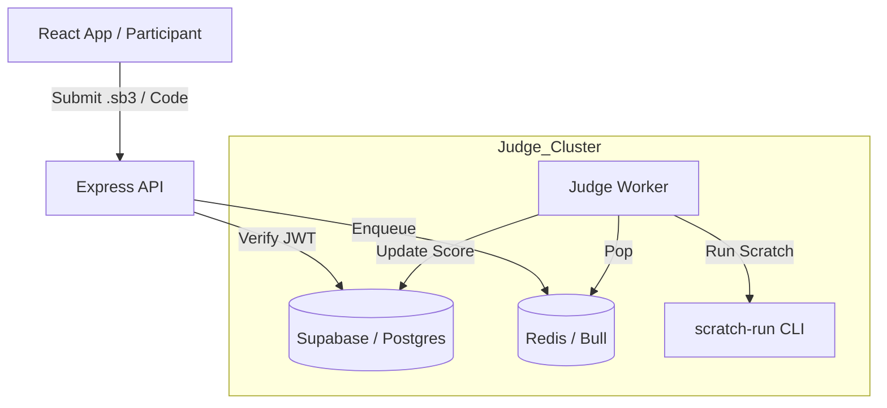

# 🏆 Tin Học Trẻ - Backend & Judge API

Hệ thống thi lập trình trực tuyến (Scratch, JavaScript, Python, Lua) dành cho các cuộc thi Tin Học Trẻ. Kiến trúc được chuẩn hóa theo mô hình **Supabase-centric**, sử dụng Express cho các tác vụ xử lý nghiệp vụ nặng (Judging) và Redis để điều phối hàng đợi chấm bài.

## 🚀 Tính năng chính

- **Judge API (Express)**: Nhận submission, xác thực JWT từ Supabase và đẩy vào Redis Queue.
- **Headless Judge (Node.js)**: Thực thi code trong môi trường cô lập, hỗ trợ chấm bài Scratch (.sb3) tự động qua `scratch-run`.
- **Supabase Integration**: Đồng bộ dữ liệu real-time, quản lý Participant, Quest và Result qua Postgres.
- **Multi-language Support**: Scratch, Blockly, JavaScript (Node.js), Python, Lua.

---

## 🏗️ Kiến trúc Hệ thống



---

## 📁 Cấu trúc Monorepo

Dịch vụ này nằm trong monorepo `react-quest-monorepo`, sử dụng **pnpm workspaces**:

```text
react-quest-monorepo/
├── apps/
│   ├── tin-hoc-tre-api/       # Backend API (Express) - Port 3000
│   ├── tin-hoc-tre-judge/     # Headless Worker (Node.js) - Port 4000
│   └── react-quest-app/       # Frontend Player (Vite + React)
├── packages/
│   ├── @tin-hoc-tre/problems/ # Metadata đề thi & Testcases (JSON)
│   └── @tin-hoc-tre/shared/   # Shared Logic & Types
└── README.md                  # Hướng dẫn chung Monorepo
```

### Lệnh chạy nhanh (từ Gốc)

```bash
# Chạy toàn bộ backend (API + Judge)
pnpm dev --filter=tin-hoc-tre-*

# Chạy riêng API
pnpm dev --filter=tin-hoc-tre-contest-platform
```

---

## 🛠️ Quy trình Chấm bài Scratch (.sb3)

Hệ thống sử dụng một workflow đặc biệt cho Scratch để đảm bảo tính khách quan:

1.  **Submission**: Client upload file `.sb3` trực tiếp lên API.
2.  **Validation**: API kiểm tra Magic Bytes và cấu trúc file Zip hợp lệ.
3.  **Queuing**: Bài thi được đưa vào hàng đợi Redis với mức ưu tiên cao.
4.  **Judging**:
    *   `scratch-run` giải nén file `.sb3`.
    *   Phân tích cây AST của `project.json` để kiểm tra các khối lệnh bắt buộc.
    *   Thực thi headless bằng Chrome/Playwright để kiểm tra tọa độ, va chạm và biến số (Variables) sau thời gian thực thi (Time-step).
5.  **Reporting**: Kết quả được đẩy ngược lên Supabase `contest_submissions` và cập nhật bảng `board_leaderboard`.

---

## 🛡️ Bảo mật & Tin cậy

| Lớp | Cơ chế | Mục tiêu |
|-----|--------|----------|
| **Cổng Auth** | Supabase Auth (JWT) | Chặn request nặc danh, định danh chính xác Participant ID. |
| **Logic API** | Rate Limiting & Multer filtering | Chống spam submission và tải lên file độc hại. |
| **Sandbox** | Headless Runner (scratch-run) | Cô lập môi trường thực thi code, tránh ảnh hưởng đến Core System. |
| **Dữ liệu** | Supabase RLS | Chỉ cho phép User xem điểm của chính mình trong thời gian thi. |

---

## 📚 Tài liệu API (Endpoints chính)

- `POST /api/judge/submit`: Nộp bài (tự động nhận diện Blockly/Script).
- `POST /api/judge/submit-sb3`: Nộp file Scratch (.sb3).
- `GET /api/judge/status/:id`: Kiểm tra trạng thái chấm bài (Polling).
- `GET /api/contest/problems`: Lấy danh sách đề bài đã được decrypt.

---

## License
MIT — Phát triển bởi **Tin Học Trẻ Open-source Team**.
