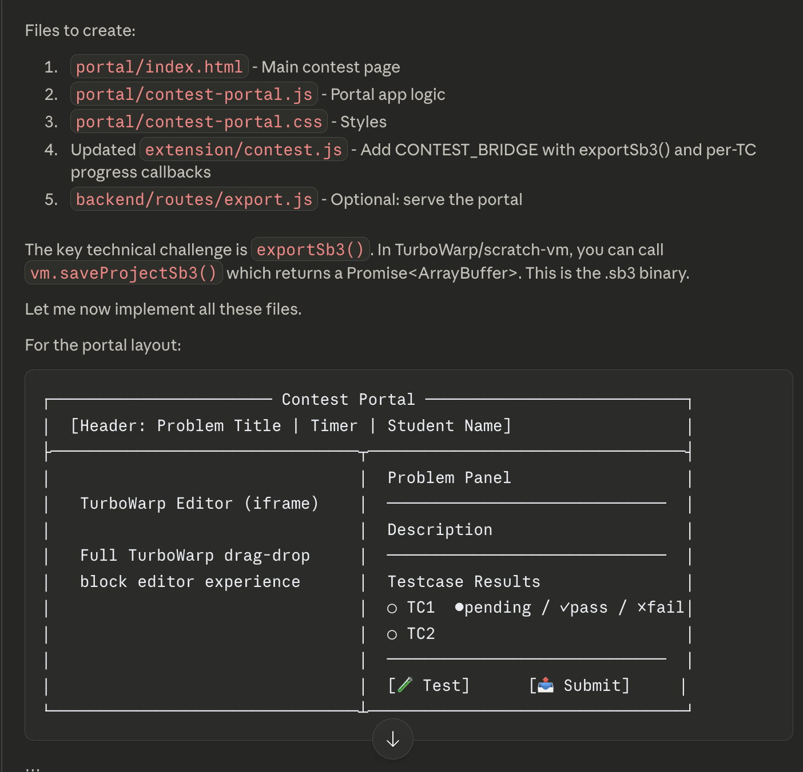
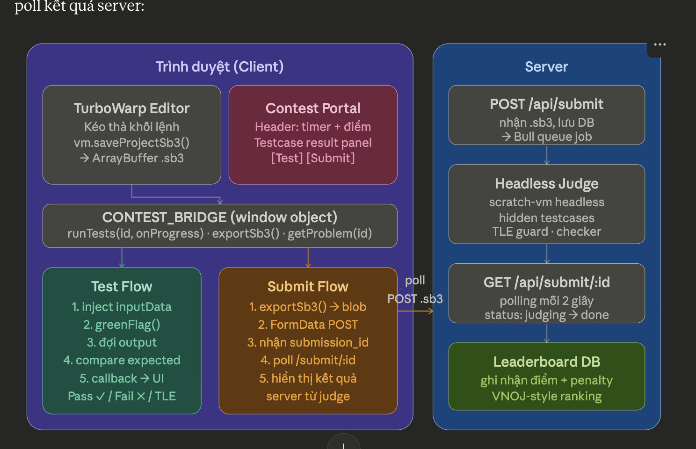

## QUESTION: nếu như tôi muốn cho phép học sinh tương tác kéo thả khối trên giao diện tương tự Scratch luốn (Turbowarp) khi nhấn Test thì sẽ chạy testcase và hiển thị kết quả Pass/Fail theo test case (chạy trên máy client) và nếu học sinh Submit thì sẽ tải nội dung lên server - chạy bộ test case nâng cao trên server và ghi nhận điểm thì cần bổ sung thêm gì?

---

Cần bổ sung 3 lớp chính: **Contest Bridge** (kết nối portal ↔ extension), **Contest Portal UI** (giao diện bọc ngoài TurboWarp), và cập nhật **extension** để hỗ trợ per-testcase callback. Để rõ hơn:Sơ đồ luồng mới cần thêm — Test chạy client-side với per-TC feedback, Submit upload và poll kết quả server:Cần thêm **4 thành phần** chính. Bắt đầu tạo code:### 1 — Extension nâng cấp: thêm `CONTEST_BRIDGE` + `exportSb3()` + per-TC callbacks### 2 — Contest Portal: HTML + CSS + JS### 3 — Backend: thêm route lịch sử nộp bài + serve portal### 4 — Leaderboard page (bonus)Đây là tóm tắt những gì vừa được bổ sung và tại sao mỗi phần cần thiết:

---

### Thay đổi kiến trúc cốt lõi

Điểm quan trọng nhất là `window.CONTEST_BRIDGE` — một object được extension đăng ký lên `window` của TurboWarp iframe. Portal (cùng origin) truy cập trực tiếp qua `iframe.contentWindow.CONTEST_BRIDGE` mà không cần rebuild scratch-gui hay thêm React component nào.

---

### 4 file mới bổ sung

`contest-v2.js` — Extension được nâng cấp với 3 method công khai trên bridge. `runTests()` nhận callback `onProgress` và gọi lại sau *từng* testcase với `{ index, status, passed, ms, output, expected }` để portal cập nhật UI theo thời gian thực. `exportSb3()` gọi `vm.saveProjectSb3()` trả về `ArrayBuffer` của file `.sb3` hiện tại — đây là điểm then chốt để Submit không cần thí sinh tự lưu file. `_emit()` gửi `postMessage` về cửa sổ cha và `CustomEvent` trong cùng window phòng cả hai trường hợp iframe và cùng trang.

`portal/index.html` + `contest-portal.css` + `contest-portal.js` — Trang bọc ngoài có layout 2 cột: bên trái là iframe TurboWarp toàn màn hình, bên phải là sidebar 320px với 3 tab. Tab "Kết quả" hiển thị từng card testcase cập nhật live khi `onTcProgress` được gọi — mỗi card có badge `Chờ → Đang chạy → ✓ Đúng / ✗ Sai / TLE`, thời gian thực thi `ms`, và nếu sai thì mở rộng hiện `output thực tế` vs `expected`. Khi Submit, portal gọi `exportSb3()`, kiểm tra magic bytes ZIP (`PK\x03\x04`), POST lên `/api/submit`, nhận `submission_id` rồi poll mỗi 2 giây cho đến khi `status` không còn là `pending/judging`.

`backend/routes/portal.js` — Serve static files cho portal và editor, thêm route `/api/submit/history/:problem_id` để load lịch sử nộp bài hiển thị ở tab "Lần nộp".

`portal/leaderboard.html` — Bảng xếp hạng tự làm mới mỗi 15 giây, hiển thị điểm + trạng thái + thời gian phạt theo chuẩn VNOJ.