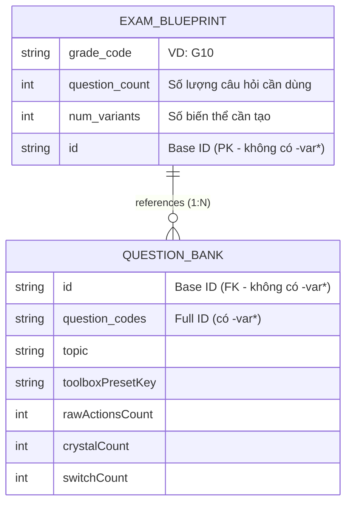
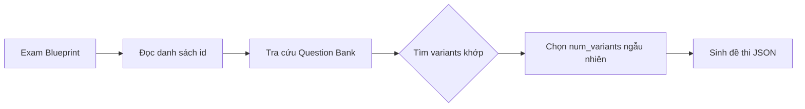

# Phân tích Mối quan hệ Dữ liệu: Blueprint & Question Bank

Tài liệu mô tả mối quan hệ giữa các file Excel trong hệ thống sinh đề thi.

---

## 📊 Tổng quan các file

| File | Columns | Rows | Mô tả |
|------|---------|------|-------|
| `exam_blueprints_practice-commands01.xlsx` | 4 | 50 | Blueprint đề thi Commands cơ bản |
| `exam_blueprints_practice-commands02.xlsx` | 4 | 50 | Blueprint đề thi Commands nâng cao |
| `question_bank.xlsx` | 18 | 1994+ | Ngân hàng câu hỏi tổng hợp |

---

## 📂 Cấu trúc Columns

### Exam Blueprints

| Column | Type | Mô tả | Ví dụ |
|--------|------|-------|-------|
| `grade_code` | string | Mã khối lớp | `G10` |
| `question_count` | int | Số câu hỏi cần dùng | `1` |
| `num_variants` | int | Số biến thể cần tạo | `3` |
| `id` | string | Base ID (không có `-var*`) | `COMMANDS_G10.CODING_COMMANDS_BASIC-MOVEMENT.SIMPLE_APPLY.C1` |

### Question Bank

| Column | Type | Mô tả |
|--------|------|-------|
| `id` | string | Base ID (không có `-var*`) |
| `question_codes` | string | Full ID (có `-var*`) |
| `topic` | string | Chủ đề bài học |
| `grade` | string | Khối lớp |
| `challenge_type` | string | Loại thử thách |
| `difficulty_code` | string | Mã độ khó |
| `gen_map_type` | string | Loại topology map |
| `gen_logic_type` | string | Loại logic sinh |
| `core_skill_codes` | string | Mã kỹ năng cần áp dụng |
| `toolboxPresetKey` | string | Bộ công cụ Blockly |
| `difficulty_intrinsic` | string | Độ khó nội tại |
| `level` | int | Số thứ tự level |
| `rawActionsCount` | int | Số hành động trong lời giải |
| `optimalBlocks` | int | Số blocks tối ưu |
| `optimalLines` | int | Số dòng code tối ưu |
| `crystalCount` | int | Số crystal cần thu |
| `switchCount` | int | Số switch cần bật |
| `obstacleCount` | int | Số chướng ngại vật |

---

## 🔗 Mối quan hệ dữ liệu (ERD)



---

## 🔑 Key Relationship

**Trường liên kết chính:** `id` (Base ID)

### Mapping Logic

| Blueprint | Question Bank | Quan hệ |
|-----------|---------------|---------|
| `id` | `id` | 1:N (một Base ID → nhiều variants) |

### Ví dụ quan hệ 1:N

**Blueprint entry:**
```
id: COMMANDS_G10.CODING_COMMANDS_BASIC-MOVEMENT.SIMPLE_APPLY.C1
num_variants: 3
```

**Question Bank entries tương ứng:**
```
id: COMMANDS_G10.CODING_COMMANDS_BASIC-MOVEMENT.SIMPLE_APPLY.C1
question_codes: ...C1-var1
question_codes: ...C1-var2  
question_codes: ...C1-var3
```

---

## 📋 Workflow sử dụng



### Chi tiết quy trình

1. **Input**: File `exam_blueprints_*.xlsx`
2. **Script**: `generate_exam_variants.py` hoặc tương tự
3. **Lookup**: Tra cứu `question_bank.xlsx` theo `id`
4. **Filter**: Lọc các `question_codes` có base `id` khớp
5. **Sample**: Chọn ngẫu nhiên `num_variants` biến thể
6. **Output**: File JSON đề thi trong `data/4_exams/`

---

## ⚠️ Lưu ý quan trọng

### 1. ID Format
- **Base ID**: `{TOPIC}_{GRADE}.{SUBJECT}_{SUBTOPIC}.{CHALLENGE_TYPE}.C{N}`
- **Full ID**: `{Base ID}-var{M}`

### 2. Metadata thiếu
Files cũ (Topic1-Done-Exam) thiếu nhiều metadata:
- `grade`, `challenge_type`, `difficulty_code`, `gen_map_type` → hiển thị `NaN`
- Chỉ có `toolboxPresetKey` để suy luận kỹ năng

### 3. Consistency
- Blueprint **PHẢI** dùng Base ID (không có `-var*`)
- Question Bank **PHẢI** có cả Base ID và Full ID

---

## 📎 Files liên quan

- [METADATA_REFERENCE_GUIDE.md](file:///Users/tonypham/MEGA/WebApp/3d-quest-map-gen/instructions/METADATA_REFERENCE_GUIDE.md) - Tham chiếu metadata đầy đủ
- [EXTRACT_MAP_INFO_ANALYSIS.md](file:///Users/tonypham/MEGA/WebApp/3d-quest-map-gen/instructions/EXTRACT_MAP_INFO_ANALYSIS.md) - Phân tích script trích xuất
- [generate_exam_from_pool.py](file:///Users/tonypham/MEGA/WebApp/3d-quest-map-gen/scripts/generate_exam_from_pool.py) - Script sinh đề thi
