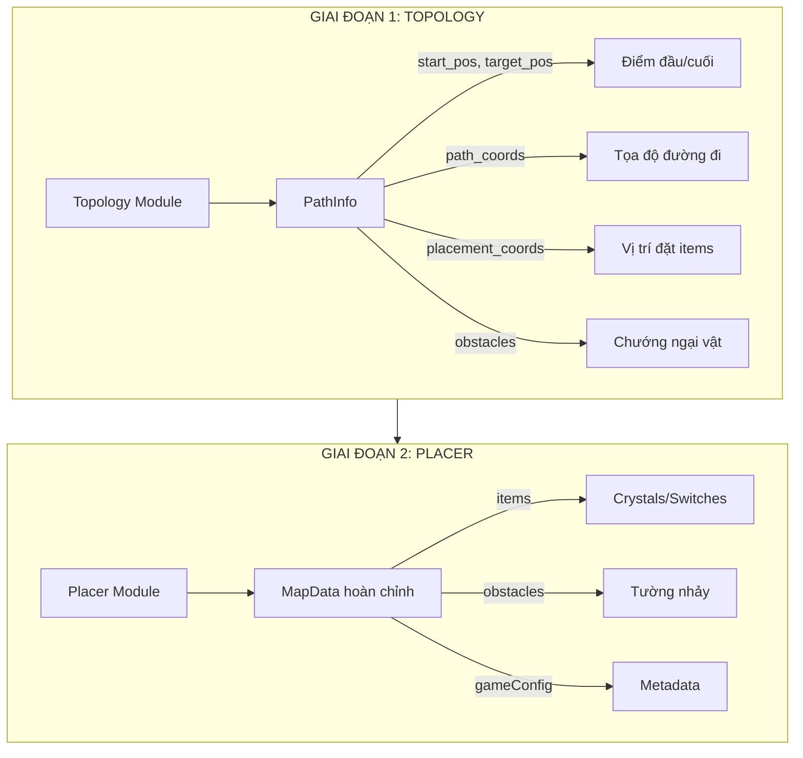
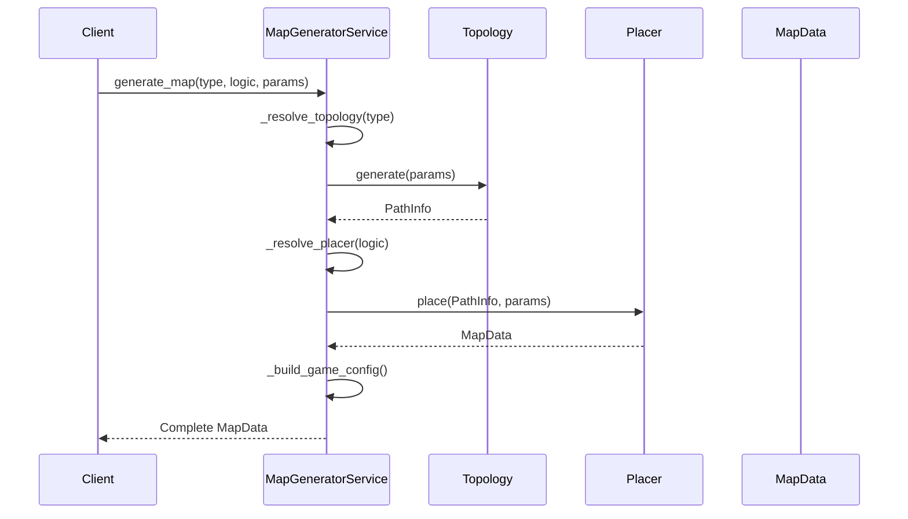
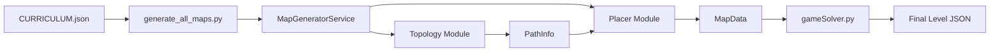

# Phân tích Chuyên sâu: Tạo Map (Map Creation)

Tài liệu phân tích chi tiết kiến trúc và cơ chế hoạt động của hệ thống sinh map tự động.

---

## 📊 Tổng quan Kiến trúc

Hệ thống sinh map sử dụng kiến trúc **Two-Stage Generation** với sự tách biệt rõ ràng giữa:



---

## 🏗️ Cấu trúc Source Code

### Thư mục chính

| Đường dẫn | Mục đích |
|-----------|----------|
| [service.py](file:///Users/tonypham/MEGA/WebApp/3d-quest-map-gen/src/map_generator/service.py) | MapGeneratorService - Điều phối chính |
| [topologies/](file:///Users/tonypham/MEGA/WebApp/3d-quest-map-gen/src/map_generator/topologies) | 32 loại cấu trúc địa hình |
| [placements/](file:///Users/tonypham/MEGA/WebApp/3d-quest-map-gen/src/map_generator/placements) | 29 chiến lược đặt vật phẩm |
| [models/](file:///Users/tonypham/MEGA/WebApp/3d-quest-map-gen/src/map_generator/models) | Data structures |

---

## 📐 GIAI ĐOẠN 1: Topology System

### Khái niệm cốt lõi

**Topology** định nghĩa **hình dạng và cấu trúc** của đường đi trong map. Mỗi topology tạo ra một `PathInfo` chứa:

```python
@dataclass
class PathInfo:
    start_pos: Position        # Điểm xuất phát
    target_pos: Position       # Điểm đích
    path_coords: List[Position] # Tọa độ đường đi (theo thứ tự)
    placement_coords: List[Position] # Vị trí có thể đặt items
    obstacles: List[Obstacle]  # Chướng ngại vật (tường nhảy, v.v.)
    walkable_tiles: Set[Position] # Tất cả ô có thể đi
```

### Danh sách Topologies (32 loại)

#### Cơ bản (Beginner)
| Topology | File | Mô tả | Params chính |
|----------|------|-------|--------------|
| `straight_line` | [straight_line.py](file:///Users/tonypham/MEGA/WebApp/3d-quest-map-gen/src/map_generator/topologies/straight_line.py) | Đường thẳng đơn giản | `path_length` |
| `l_shape` | [l_shape.py](file:///Users/tonypham/MEGA/WebApp/3d-quest-map-gen/src/map_generator/topologies/l_shape.py) | Hình chữ L (1 góc rẽ) | `arm1_length`, `arm2_length` |
| `u_shape` | [u_shape.py](file:///Users/tonypham/MEGA/WebApp/3d-quest-map-gen/src/map_generator/topologies/u_shape.py) | Hình chữ U | `width`, `height` |
| `v_shape` | [v_shape.py](file:///Users/tonypham/MEGA/WebApp/3d-quest-map-gen/src/map_generator/topologies/v_shape.py) | Hình chữ V | `arm_length`, `angle` |

#### Trung cấp (Intermediate)
| Topology | File | Mô tả | Params chính |
|----------|------|-------|--------------|
| `t_shape` | [t_shape.py](file:///Users/tonypham/MEGA/WebApp/3d-quest-map-gen/src/map_generator/topologies/t_shape.py) | Hình chữ T | `stem_length`, `crossbar_length` |
| `plus_shape` | [plus_shape.py](file:///Users/tonypham/MEGA/WebApp/3d-quest-map-gen/src/map_generator/topologies/plus_shape.py) | Hình dấu + | `arm_length`, `center_size` |
| `h_shape` | [h_shape.py](file:///Users/tonypham/MEGA/WebApp/3d-quest-map-gen/src/map_generator/topologies/h_shape.py) | Hình chữ H | `vertical_length`, `horizontal_length` |
| `s_shape` | [s_shape.py](file:///Users/tonypham/MEGA/WebApp/3d-quest-map-gen/src/map_generator/topologies/s_shape.py) | Hình chữ S | `segment_length` |
| `z_shape` | [z_shape.py](file:///Users/tonypham/MEGA/WebApp/3d-quest-map-gen/src/map_generator/topologies/z_shape.py) | Hình chữ Z | `segment_length` |
| `zigzag` | [zigzag.py](file:///Users/tonypham/MEGA/WebApp/3d-quest-map-gen/src/map_generator/topologies/zigzag.py) | Đường zigzag | `segments`, `segment_length` |

#### Nâng cao (Advanced)
| Topology | File | Mô tả | Params chính |
|----------|------|-------|--------------|
| `spiral` | [spiral.py](file:///Users/tonypham/MEGA/WebApp/3d-quest-map-gen/src/map_generator/topologies/spiral.py) | Xoắn ốc 2D | `layers`, `expansion_rate` |
| `spiral_3d` | [spiral_3d.py](file:///Users/tonypham/MEGA/WebApp/3d-quest-map-gen/src/map_generator/topologies/spiral_3d.py) | Xoắn ốc 3D | `layers`, `height_per_layer` |
| `staircase` | [staircase.py](file:///Users/tonypham/MEGA/WebApp/3d-quest-map-gen/src/map_generator/topologies/staircase.py) | Cầu thang | `steps`, `step_height` |
| `staircase_3d` | [staircase_3d.py](file:///Users/tonypham/MEGA/WebApp/3d-quest-map-gen/src/map_generator/topologies/staircase_3d.py) | Cầu thang 3D | `layers`, `steps_per_layer` |
| `complex_maze` | [complex_maze.py](file:///Users/tonypham/MEGA/WebApp/3d-quest-map-gen/src/map_generator/topologies/complex_maze.py) | Mê cung DFS | `maze_width`, `maze_depth` |
| `plowing_field` | [plowing_field.py](file:///Users/tonypham/MEGA/WebApp/3d-quest-map-gen/src/map_generator/topologies/plowing_field.py) | Lưới zigzag (nested loops) | `rows`, `cols` |
| `grid` | [grid.py](file:///Users/tonypham/MEGA/WebApp/3d-quest-map-gen/src/map_generator/topologies/grid.py) | Lưới đơn giản | `width`, `height` |
| `grid_with_holes` | [grid_with_holes.py](file:///Users/tonypham/MEGA/WebApp/3d-quest-map-gen/src/map_generator/topologies/grid_with_holes.py) | Lưới có lỗ | `width`, `height`, `hole_count` |

#### Chuyên dụng (Specialized)
| Topology | File | Mô tả | Params chính |
|----------|------|-------|--------------|
| `star_shape` | [star_shape.py](file:///Users/tonypham/MEGA/WebApp/3d-quest-map-gen/src/map_generator/topologies/star_shape.py) | Hình ngôi sao | `points`, `inner_radius` |
| `arrow_shape` | [arrow_shape.py](file:///Users/tonypham/MEGA/WebApp/3d-quest-map-gen/src/map_generator/topologies/arrow_shape.py) | Hình mũi tên | `shaft_length`, `head_width` |
| `triangle` | [triangle.py](file:///Users/tonypham/MEGA/WebApp/3d-quest-map-gen/src/map_generator/topologies/triangle.py) | Tam giác | `base`, `height` |
| `square` | [square.py](file:///Users/tonypham/MEGA/WebApp/3d-quest-map-gen/src/map_generator/topologies/square.py) | Hình vuông | `side_length` |
| `ef_shape` | [ef_shape.py](file:///Users/tonypham/MEGA/WebApp/3d-quest-map-gen/src/map_generator/topologies/ef_shape.py) | Chữ E hoặc F | `type`, `segment_length` |

#### 3D Platforms
| Topology | File | Mô tả | Params chính |
|----------|------|-------|--------------|
| `swift_playground_maze` | [swift_playground_maze.py](file:///Users/tonypham/MEGA/WebApp/3d-quest-map-gen/src/map_generator/topologies/swift_playground_maze.py) | Mê cung nhiều tầng | `platform_count`, `height_variation` |
| `symmetrical_islands` | [symmetrical_islands.py](file:///Users/tonypham/MEGA/WebApp/3d-quest-map-gen/src/map_generator/topologies/symmetrical_islands.py) | Đảo đối xứng | `island_count`, `island_size` |
| `hub_with_stepped_islands` | [hub_with_stepped_islands.py](file:///Users/tonypham/MEGA/WebApp/3d-quest-map-gen/src/map_generator/topologies/hub_with_stepped_islands.py) | Hub trung tâm + đảo | `hub_size`, `island_count` |
| `plus_shape_islands` | [plus_shape_islands.py](file:///Users/tonypham/MEGA/WebApp/3d-quest-map-gen/src/map_generator/topologies/plus_shape_islands.py) | Dấu + với đảo | `arm_length`, `island_count` |
| `stepped_island_clusters` | [stepped_island_clusters.py](file:///Users/tonypham/MEGA/WebApp/3d-quest-map-gen/src/map_generator/topologies/stepped_island_clusters.py) | Cụm đảo bậc thang | `cluster_count` |
| `interspersed_path` | [interspersed_path.py](file:///Users/tonypham/MEGA/WebApp/3d-quest-map-gen/src/map_generator/topologies/interspersed_path.py) | Đường đi xen kẽ | `main_path_length`, `branch_count` |

### Cơ chế hoạt động của Topology

```python
# Ví dụ: LShapeTopology
class LShapeTopology(BaseTopology):
    def generate(self, params: dict) -> PathInfo:
        arm1_len = params.get('arm1_length', 4)
        arm2_len = params.get('arm2_length', 4)
        
        # 1. Tính toán tọa độ đường đi
        path_coords = []
        # Đoạn thẳng 1
        for i in range(arm1_len):
            path_coords.append({'x': i, 'y': 0, 'z': 0})
        # Góc rẽ + đoạn thẳng 2
        for j in range(1, arm2_len + 1):
            path_coords.append({'x': arm1_len - 1, 'y': j, 'z': 0})
        
        # 2. Xác định điểm đặt item (bỏ qua start và end)
        placement_coords = path_coords[1:-1]
        
        return PathInfo(
            start_pos=path_coords[0],
            target_pos=path_coords[-1],
            path_coords=path_coords,
            placement_coords=placement_coords,
            obstacles=[],
            walkable_tiles=set(tuple(p.values()) for p in path_coords)
        )
```

---

## 🎯 GIAI ĐOẠN 2: Placer System

### Khái niệm cốt lõi

**Placer** nhận `PathInfo` từ Topology và quyết định **đặt gì** và **ở đâu**:

- **Items**: Crystals, switches, collectibles
- **Obstacles**: Tường nhảy, cổng, nền di động
- **Logic type**: Xác định mục tiêu sư phạm

### Danh sách Placers (29 loại)

#### Core Placers
| Placer | File | Mục đích | Dùng cho |
|--------|------|----------|----------|
| `base_placer` | [base_placer.py](file:///Users/tonypham/MEGA/WebApp/3d-quest-map-gen/src/map_generator/placements/base_placer.py) | Abstract base class | Kế thừa |
| `sequencing_placer` | [sequencing_placer.py](file:///Users/tonypham/MEGA/WebApp/3d-quest-map-gen/src/map_generator/placements/sequencing_placer.py) | Đặt items theo thứ tự | Commands L1-L4 |
| `obstacle_placer` | [obstacle_placer.py](file:///Users/tonypham/MEGA/WebApp/3d-quest-map-gen/src/map_generator/placements/obstacle_placer.py) | Đặt obstacles để buộc jump | Commands L3+ |
| `command_obstacle_placer` | [command_obstacle_placer.py](file:///Users/tonypham/MEGA/WebApp/3d-quest-map-gen/src/map_generator/placements/command_obstacle_placer.py) | Nâng cao với nhiều loại obstacle | Advanced commands |

#### Loop-focused Placers
| Placer | File | Mục đích | Dùng cho |
|--------|------|----------|----------|
| `for_loop_placer` | [for_loop_placer.py](file:///Users/tonypham/MEGA/WebApp/3d-quest-map-gen/src/map_generator/placements/for_loop_placer.py) | Tối ưu cho vòng lặp đếm | For loops topic |
| `ForLoopPlacer` | [ForLoopPlacer.py](file:///Users/tonypham/MEGA/WebApp/3d-quest-map-gen/src/map_generator/placements/ForLoopPlacer.py) | Legacy for loop | Deprecated |
| `while_if_placer` | [while_if_placer.py](file:///Users/tonypham/MEGA/WebApp/3d-quest-map-gen/src/map_generator/placements/while_if_placer.py) | While + conditionals | While/If topics |

#### Function/Algorithm Placers
| Placer | File | Mục đích | Dùng cho |
|--------|------|----------|----------|
| `function_placer` | [function_placer.py](file:///Users/tonypham/MEGA/WebApp/3d-quest-map-gen/src/map_generator/placements/function_placer.py) | Pattern recognition cho hàm | Functions topic |
| `algorithm_placer` | [algorithm_placer.py](file:///Users/tonypham/MEGA/WebApp/3d-quest-map-gen/src/map_generator/placements/algorithm_placer.py) | Bài toán tìm kiếm/tối ưu | Algorithms topic |
| `PathSearchingPlacer` | [PathSearchingPlacer.py](file:///Users/tonypham/MEGA/WebApp/3d-quest-map-gen/src/map_generator/placements/PathSearchingPlacer.py) | Tìm đường nâng cao | Algorithm challenges |
| `path_searching_swift_placer` | [path_searching_swift_placer.py](file:///Users/tonypham/MEGA/WebApp/3d-quest-map-gen/src/map_generator/placements/path_searching_swift_placer.py) | Path finding cho Swift maps | 3D platforms |

#### Variable Placer
| Placer | File | Mục đích | Dùng cho |
|--------|------|----------|----------|
| `variable_placer` | [variable_placer.py](file:///Users/tonypham/MEGA/WebApp/3d-quest-map-gen/src/map_generator/placements/variable_placer.py) | Bài toán biến số | Variables & Math topic |

#### Topology-specific Placers
| Placer | File | Topology tương ứng |
|--------|------|-------------------|
| `spiral_placer` | [spiral_placer.py](file:///Users/tonypham/MEGA/WebApp/3d-quest-map-gen/src/map_generator/placements/spiral_placer.py) | spiral |
| `spiral_3d_placer` | [spiral_3d_placer.py](file:///Users/tonypham/MEGA/WebApp/3d-quest-map-gen/src/map_generator/placements/spiral_3d_placer.py) | spiral_3d |
| `staircase_3d_placer` | [staircase_3d_placer.py](file:///Users/tonypham/MEGA/WebApp/3d-quest-map-gen/src/map_generator/placements/staircase_3d_placer.py) | staircase_3d |
| `swift_playground_placer` | [swift_playground_placer.py](file:///Users/tonypham/MEGA/WebApp/3d-quest-map-gen/src/map_generator/placements/swift_playground_placer.py) | swift_playground_maze |
| `island_tour_placer` | [island_tour_placer.py](file:///Users/tonypham/MEGA/WebApp/3d-quest-map-gen/src/map_generator/placements/island_tour_placer.py) | symmetrical_islands, hub_* |
| `triangle_placer` | [triangle_placer.py](file:///Users/tonypham/MEGA/WebApp/3d-quest-map-gen/src/map_generator/placements/triangle_placer.py) | triangle |
| Shape-specific | [arrow_shape_placer.py](file:///Users/tonypham/MEGA/WebApp/3d-quest-map-gen/src/map_generator/placements/arrow_shape_placer.py), [h_shape_placer.py](file:///Users/tonypham/MEGA/WebApp/3d-quest-map-gen/src/map_generator/placements/h_shape_placer.py), [t_shape_placer.py](file:///Users/tonypham/MEGA/WebApp/3d-quest-map-gen/src/map_generator/placements/t_shape_placer.py), [plus_shape_placer.py](file:///Users/tonypham/MEGA/WebApp/3d-quest-map-gen/src/map_generator/placements/plus_shape_placer.py), [v_shape_placer.py](file:///Users/tonypham/MEGA/WebApp/3d-quest-map-gen/src/map_generator/placements/v_shape_placer.py), [z_shape_placer.py](file:///Users/tonypham/MEGA/WebApp/3d-quest-map-gen/src/map_generator/placements/z_shape_placer.py), [zigzag_placer.py](file:///Users/tonypham/MEGA/WebApp/3d-quest-map-gen/src/map_generator/placements/zigzag_placer.py), [star_shape_placer.py](file:///Users/tonypham/MEGA/WebApp/3d-quest-map-gen/src/map_generator/placements/star_shape_placer.py), [ef_shape_placer.py](file:///Users/tonypham/MEGA/WebApp/3d-quest-map-gen/src/map_generator/placements/ef_shape_placer.py), [grid_with_holes_placer.py](file:///Users/tonypham/MEGA/WebApp/3d-quest-map-gen/src/map_generator/placements/grid_with_holes_placer.py) | Các shape tương ứng |

### Placement Strategies

Thư mục [strategies/](file:///Users/tonypham/MEGA/WebApp/3d-quest-map-gen/src/map_generator/placements/strategies) chứa các chiến lược đặt items có thể tái sử dụng.

---

## ⚙️ MapGeneratorService

### API chính

```python
from src.map_generator.service import MapGeneratorService

service = MapGeneratorService()

# Sinh một map đơn lẻ
map_data = service.generate_map(
    map_type='l_shape',           # Topology name
    logic_type='sequencing',      # Placer name
    params={
        'path_length': 6,
        'items_to_place': ['crystal', 'switch'],
        'obstacle_count': 2
    }
)

# Sinh nhiều biến thể
for variant in service.generate_map_variants(
    map_type='complex_maze',
    logic_type='algorithm',
    params={
        'maze_width': [5, 10],    # Range values
        'maze_depth': [5, 10]
    },
    max_variants=10
):
    process(variant)
```

### Flow xử lý trong Service



---

## 📦 Output Structure

### MapData Schema

```json
{
  "id": "MAP-001-straight_line-sequencing",
  "gameConfig": {
    "playerStartPosition": {"x": 0, "y": 0, "z": 0},
    "playerStartDirection": "SOUTH",
    "targetPosition": {"x": 0, "y": 5, "z": 0},
    "itemGoals": {
      "crystal": 3,
      "switch": 1
    },
    "toolboxPresetKey": "commands_l3_collect",
    "theme": "digital"
  },
  "tiles": [
    {"x": 0, "y": 0, "z": 0, "type": "GROUND"},
    {"x": 0, "y": 1, "z": 0, "type": "GROUND"},
    ...
  ],
  "collectibles": [
    {"x": 0, "y": 1, "z": 1, "type": "crystal", "id": "crystal_1"},
    {"x": 0, "y": 2, "z": 1, "type": "crystal", "id": "crystal_2"}
  ],
  "switches": [
    {"x": 0, "y": 3, "z": 1, "id": "switch_1", "initialState": "OFF"}
  ],
  "obstacles": [
    {"x": 0, "y": 4, "z": 0, "type": "jumpable_wall", "height": 1}
  ],
  "generation_config": {
    "map_type": "straight_line",
    "logic_type": "sequencing",
    "params": {...}
  }
}
```

---

## 🔗 Liên kết với Pipeline

### Script điều phối: [generate_all_maps.py](file:///Users/tonypham/MEGA/WebApp/3d-quest-map-gen/scripts/generate_all_maps.py)



### Transformation trong generate_all_maps.py

1. **Đọc curriculum** → Lấy danh sách `map_request`
2. **Extract params** → `gen_map_type`, `gen_params`, `toolbox_preset`
3. **Call Service** → `MapGeneratorService.generate_map()`
4. **Solve** → `gameSolver.solve_map_and_get_solution()`
5. **Build output** → Thêm `rawActions`, `structuredSolution`, `startBlocks`

---

## 📚 Tài liệu liên quan

- [MAP_GENERATION_SOLVING_PIPELINE.md](file:///Users/tonypham/MEGA/WebApp/3d-quest-map-gen/instructions/MAP_GENERATION_SOLVING_PIPELINE.md) - Tổng quan pipeline
- [SCRIPT_ANALYSIS_REPORT.md](file:///Users/tonypham/MEGA/WebApp/3d-quest-map-gen/instructions/SCRIPT_ANALYSIS_REPORT.md) - Phân tích scripts
- [METADATA_REFERENCE_GUIDE.md](file:///Users/tonypham/MEGA/WebApp/3d-quest-map-gen/instructions/METADATA_REFERENCE_GUIDE.md) - Tham khảo metadata
