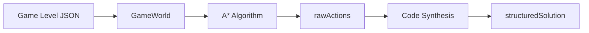

# Phân tích Chuyên sâu: Solving Engine (Giải Màn chơi)

Tài liệu phân tích thuật toán và cơ chế hoạt động của engine giải màn chơi.

---

## 📊 Tổng quan Kiến trúc



---

## 🗂️ File chính: [gameSolver.py](file:///Users/tonypham/MEGA/WebApp/3d-quest-map-gen/scripts/gameSolver.py)

| Section | Dòng | Chức năng |
|---------|------|-----------|
| Type Definitions | 28-33 | Định nghĩa kiểu dữ liệu |
| GameWorld | 34-142 | Mô hình hóa thế giới game |
| GameState & PathNode | 143-177 | Trạng thái và node tìm đường |
| Meta-Solver TSP | 178-382 | Giải bài toán TSP phức tạp |
| A* Algorithm | 383-610 | Thuật toán tìm đường chính |
| Code Synthesis | 611-682 | Tổng hợp code từ actions |

---

## 🌍 GameWorld Class

**Mục đích**: Đọc JSON và xây dựng mô hình thế giới game có thể truy vấn.

### Thuộc tính chính
- `start_pos`, `finish_pos`: Vị trí bắt đầu và kết thúc
- `world_map`: Dict mapping position → tile info
- `collectibles`: Dict mapping position → collectible info
- `switches`: Dict mapping id → switch info
- `obstacles`: Dict mapping position → obstacle info
- `available_blocks`: Set các block được phép từ toolbox

---

## 🎮 GameState & PathNode

### GameState
Snapshot trạng thái game tại một thời điểm:
- `x, y, z`: Vị trí hiện tại
- `direction`: Hướng nhìn (NORTH/SOUTH/EAST/WEST)
- `collected_items`: Items đã thu (frozenset)
- `switch_states`: Trạng thái các switch

### PathNode
Node cho A* với:
- `state`: GameState
- `parent`: Node cha
- `action`: Hành động đến node này
- `g_cost`, `h_cost`: Chi phí thực và ước lượng

---

## 🧮 A* Algorithm

### Heuristic Function
```python
h = manhattan(current, target) + uncollected_items * 5 + switches_needed * 3
```

### Các hành động có thể

| Action | Điều kiện | Chi phí |
|--------|-----------|---------|
| `moveForward` | Có ground phía trước | 1.0 |
| `turnLeft/Right` | Luôn có thể | 1.0 |
| `jump` | Có obstacle jumpable | 1.5 |
| `collect` | Đứng trên collectible | 0.5 |
| `toggleSwitch` | Đứng trên switch | 0.5 |

### Goal Check
1. Đứng tại `targetPosition`
2. Thu đủ crystals theo `itemGoals`
3. Bật đủ switches theo `itemGoals`

---

## 🔄 TSP Meta-Solver

Khi map có nhiều mục tiêu, sử dụng TSP để tìm thứ tự thu thập tối ưu:
1. Liệt kê goals (collectibles + target)
2. Tính khoảng cách giữa các goals
3. Tìm thứ tự tối ưu (nearest neighbor)
4. Ghép path segments

---

## 🔧 Code Synthesis

### find_most_frequent_sequence
Tìm chuỗi con xuất hiện ≥2 lần → PROCEDURE

### compress_actions_to_structure
Nén repeating patterns → `maze_repeat`

### Output format
```json
{
  "main": [{"type": "maze_turn"}, {"type": "maze_repeat", "times": 3, "body": [...]}],
  "procedures": {"PROCEDURE_1": [...]}
}
```

---

## 📊 Output Metrics

| Metric | Mô tả |
|--------|-------|
| `rawActionsCount` | Số hành động thực thi |
| `optimalBlocks` | Số Blockly blocks tối ưu |
| `optimalLines` | Logical Lines of Code |

---

## 📚 Tài liệu liên quan
- [DEEP_ANALYSIS_01_MAP_CREATION.md](file:///Users/tonypham/MEGA/WebApp/3d-quest-map-gen/instructions/DEEP_ANALYSIS_01_MAP_CREATION.md)
- [calculate_lines.py](file:///Users/tonypham/MEGA/WebApp/3d-quest-map-gen/scripts/calculate_lines.py)
