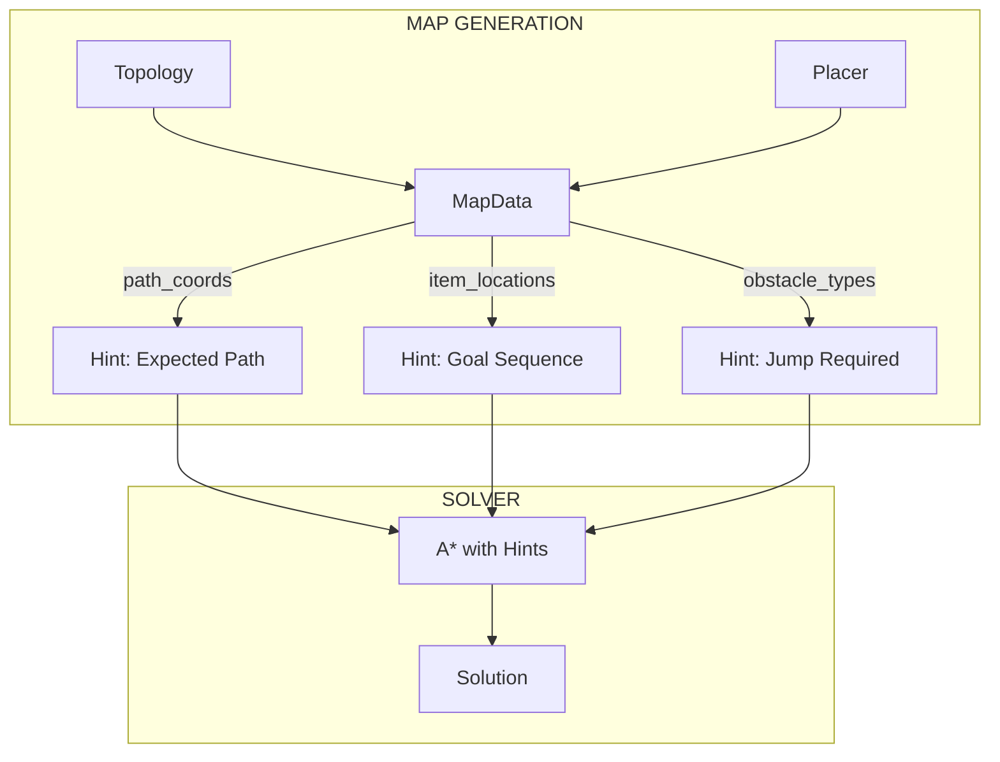

# Phân tích Sâu: Vấn đề Tồn đọng, Bug tiềm ẩn & Đề xuất Cải tiến

Tài liệu phân tích kỹ thuật chuyên sâu về hệ thống sinh và giải màn chơi.

---

## 📊 Tổng quan Phân tích

Dựa trên phân tích code của `gameSolver.py` (1241 lines), `service.py` (229 lines), và các module topology/placer, tài liệu này tổng hợp:

1. **Vấn đề tồn đọng** và **Bug tiềm ẩn**
2. **Best Practices** có thể áp dụng
3. **Logic bổ sung** và **Cách tiếp cận mới**

---

## 🔴 PHẦN 1: VẤN ĐỀ TỒN ĐỌNG & BUG TIỀM ẨN

### 1.1 Map Generation (Sinh Map)

#### ⚠️ Issue #1: Grid Size không nhất quán

**Vị trí**: [service.py:114](file:///Users/tonypham/MEGA/WebApp/3d-quest-map-gen/src/map_generator/service.py#L114) vs [service.py:183](file:///Users/tonypham/MEGA/WebApp/3d-quest-map-gen/src/map_generator/service.py#L183)

```python
# generate_map_variants: grid_size = (40, 40, 40) or (35, 35, 35)
# generate_map:          grid_size = (40, 40, 40) or (25, 25, 25)
```

**Vấn đề**: Kích thước grid khác nhau có thể gây ra edge cases khi map được sinh ở một method nhưng được xử lý ở method khác.

**Đề xuất**:
```python
def _get_default_grid_size(self, map_type: str) -> Tuple[int, int, int]:
    """Centralized grid size configuration."""
    SIZE_CONFIG = {
        'swift_playground_maze': (40, 40, 40),
        'complex_maze_2d': (35, 35, 35),
        # default
    }
    return SIZE_CONFIG.get(map_type, (30, 30, 30))
```

---

#### ⚠️ Issue #2: Theme Assignment có thể tạo bias

**Vị trí**: [service.py:134-136](file:///Users/tonypham/MEGA/WebApp/3d-quest-map-gen/src/map_generator/service.py#L134-L136)

```python
new_theme = get_new_theme_for_map(map_type, used_themes_for_challenge)
variant_params['asset_theme'] = new_theme
used_themes_for_challenge.add((new_theme.get("ground"), new_theme.get("obstacle")))
```

**Vấn đề**: 
- Chỉ track `(ground, obstacle)` tuple, bỏ qua các thuộc tính theme khác
- Nếu hết theme phù hợp, có thể gây lỗi hoặc lặp theme

**Đề xuất**: Thêm fallback mechanism và log warning khi theme pool cạn kiệt.

---

#### ⚠️ Issue #3: Placer Selection không linh hoạt

**Vị trí**: [service.py:71-98](file:///Users/tonypham/MEGA/WebApp/3d-quest-map-gen/src/map_generator/service.py#L71-L98)

**Vấn đề**: Logic type → Placer mapping là static dict, không cho phép:
- Fallback placer khi primary không compatible
- Dynamic placer selection dựa trên params

**Đề xuất**:
```python
def _select_placer(self, logic_type: str, map_type: str, params: dict):
    """Smart placer selection with fallback."""
    primary = self.placements.get(logic_type)
    if primary and primary.supports(map_type, params):
        return primary
    # Fallback chain
    for fallback in self._get_fallback_placers(logic_type):
        if fallback.supports(map_type, params):
            logging.warning(f"Using fallback placer for {logic_type}")
            return fallback
    raise ValueError(f"No compatible placer for {logic_type}")
```

---

### 1.2 Solving Engine (Giải Màn chơi)

#### 🔴 Bug #1: TSP Meta-Solver bị vô hiệu hóa nhưng code vẫn tồn tại

**Vị trí**: [gameSolver.py:492](file:///Users/tonypham/MEGA/WebApp/3d-quest-map-gen/scripts/gameSolver.py#L492)

```python
if False and not is_sub_problem:  # Luôn luôn là False
    return _solve_multi_goal_tsp(world)
```

**Vấn đề**:
- ~200 dòng code TSP (180-382) không bao giờ chạy
- Vẫn có potential bugs trong code đó nếu sau này bật lại
- Gây confusion cho developers

**Đề xuất**: 
1. Xóa hoàn toàn code TSP nếu không cần
2. HOẶC tạo feature flag có thể bật/tắt qua config

---

#### 🔴 Bug #2: State key có thể collision

**Vị trí**: [gameSolver.py:161-164](file:///Users/tonypham/MEGA/WebApp/3d-quest-map-gen/scripts/gameSolver.py#L161-L164)

```python
def get_key(self) -> str:
    items = ",".join(sorted(list(self.collected_items)))
    switches = ",".join(sorted([f"{k}:{v}" for k, v in self.switch_states.items()]))
    return f"{self.x},{self.y},{self.z},{self.direction}|i:{items}|s:{switches}"
```

**Vấn đề**: Nếu item ID chứa `,` hoặc `|`, key sẽ bị sai.

**Đề xuất**:
```python
def get_key(self) -> Tuple:
    """Use tuple for guaranteed uniqueness."""
    return (
        self.x, self.y, self.z, self.direction,
        frozenset(self.collected_items),
        tuple(sorted(self.switch_states.items()))
    )
```

---

#### ⚠️ Issue #4: Heuristic không tối ưu cho multi-goal

**Vị trí**: [gameSolver.py:399-425](file:///Users/tonypham/MEGA/WebApp/3d-quest-map-gen/scripts/gameSolver.py#L399-L425)

```python
def heuristic(state: GameState) -> int:
    # ...
    if sub_goal_positions:
        h = max(manhattan(current_pos, pos) + manhattan(pos, world.finish_pos) 
                for pos in sub_goal_positions)
    # ...
```

**Vấn đề**: 
- Heuristic dùng `max` thay vì sum of distances
- Không xét đến thứ tự thu thập tối ưu
- `* 5` penalty quá thô

**Đề xuất - Improved Heuristic**:
```python
def heuristic_v2(state: GameState) -> float:
    """MST-based heuristic for multi-goal problems."""
    uncollected = get_uncollected_positions(state)
    if not uncollected:
        return manhattan(state.pos, world.finish_pos)
    
    # Minimum Spanning Tree heuristic
    all_points = [state.pos] + list(uncollected) + [world.finish_pos]
    mst_cost = compute_mst_cost(all_points)
    
    # Weight by goal type importance
    weighted_penalty = sum(
        GOAL_WEIGHTS.get(get_goal_type(pos), 1.0)
        for pos in uncollected
    )
    
    return mst_cost + weighted_penalty * 2
```

---

#### ⚠️ Issue #5: Plowing field detection không robust

**Vị trí**: [gameSolver.py:127-142](file:///Users/tonypham/MEGA/WebApp/3d-quest-map-gen/scripts/gameSolver.py#L127-L142)

```python
def _detect_plowing_field(self) -> Optional[Dict]:
    positions = [(c['position']['x'], c['position']['z']) for c in self.collectibles_by_id.values()]
    if len(positions) < 9: return None
    # ...
    if len(grid) < len(xs) * len(zs) - 2:  # Cho phép thiếu tối đa 2 ô
        return None
```

**Vấn đề**:
- Hard-coded thresholds (9 items, 2 missing allowed)
- Không xét đến spacing/gap patterns
- Có thể false positive với các layout khác

**Đề xuất**:
```python
def _detect_plowing_field_v2(self) -> Optional[Dict]:
    """Enhanced plowing field detection with configurable thresholds."""
    MIN_GRID_SIZE = 3
    MAX_MISSING_RATIO = 0.2  # 20% missing allowed
    
    positions = self._extract_2d_positions()
    xs, zs = sorted(set(p[0] for p in positions)), sorted(set(p[1] for p in positions))
    
    # Check grid regularity
    if len(xs) < MIN_GRID_SIZE or len(zs) < MIN_GRID_SIZE:
        return None
    
    # Check spacing uniformity
    x_spacing = self._calculate_spacing(xs)
    z_spacing = self._calculate_spacing(zs)
    if not self._is_uniform_spacing(x_spacing) or not self._is_uniform_spacing(z_spacing):
        return None
    
    # Check completeness
    expected = len(xs) * len(zs)
    actual = len(positions)
    if actual / expected < (1 - MAX_MISSING_RATIO):
        return None
    
    return {"rows": len(zs), "cols": len(xs), "spacing": (x_spacing[0], z_spacing[0])}
```

---

#### ⚠️ Issue #6: Code synthesis logic phức tạp và khó maintain

**Vị trí**: [gameSolver.py:714-947](file:///Users/tonypham/MEGA/WebApp/3d-quest-map-gen/scripts/gameSolver.py#L714-L947)

**Vấn đề**:
- `synthesize_program` function có 230+ dòng
- Nhiều nested conditionals
- Logic type checking bằng string matching
- Hard to unit test

**Đề xuất - Strategy Pattern**:
```python
class SynthesizerStrategy:
    def can_handle(self, logic_type: str, world: GameWorld) -> bool:
        raise NotImplementedError
    
    def synthesize(self, actions: List[str], world: GameWorld) -> Dict:
        raise NotImplementedError

class PlowingFieldSynthesizer(SynthesizerStrategy):
    def can_handle(self, logic_type, world):
        return world._detect_plowing_field() is not None
    
    def synthesize(self, actions, world):
        # Dedicated plowing field logic
        pass

# In synthesize_program:
SYNTHESIZERS = [PlowingFieldSynthesizer(), VariableLoopSynthesizer(), ...]
for synth in SYNTHESIZERS:
    if synth.can_handle(logic_type, world):
        return synth.synthesize(actions, world)
return DefaultSynthesizer().synthesize(actions, world)
```

---

### 1.3 Liên kết Map Generation → Solver

#### ⚠️ Issue #7: generation_config không được sử dụng đầy đủ

**Vị trí**: [gameSolver.py:69](file:///Users/tonypham/MEGA/WebApp/3d-quest-map-gen/scripts/gameSolver.py#L69)

```python
self.generation_config: Dict[str, Any] = json_data.get('generation_config', {})
```

**Vấn đề**: `generation_config` chứa nhiều thông tin quý giá từ Map Generator nhưng Solver chỉ dùng một phần nhỏ.

**Thông tin có thể khai thác thêm**:

| Field | Hiện tại | Có thể dùng cho |
|-------|----------|-----------------|
| `map_type` | ✅ Dùng | Detection |
| `logic_type` | ✅ Dùng | Synthesis |
| `params` | ⚠️ Partial | Heuristic tuning |
| `path_coords` | ❌ Không dùng | Optimal path hint |
| `branch_coords` | ❌ Không dùng | Multi-path exploration |
| `placement_coords` | ❌ Không dùng | Item location validation |

**Đề xuất - Enriched Solver Context**:
```python
class SolverContext:
    """Bridge between Map Generator and Solver."""
    def __init__(self, generation_config: dict):
        self.map_type = generation_config.get('map_type')
        self.logic_type = generation_config.get('logic_type')
        self.path_hint = generation_config.get('path_coords', [])
        self.expected_actions = self._estimate_actions()
    
    def get_heuristic_params(self) -> dict:
        """Return tuned heuristic parameters based on map characteristics."""
        return {
            'goal_weight': 3 if self.map_type == 'plowing_field' else 5,
            'turn_cost': 0.05 if self.map_type == 'zigzag' else 0.1,
            'use_path_hint': len(self.path_hint) > 0
        }
```

---

## 🟢 PHẦN 2: BEST PRACTICES ĐỀ XUẤT

### 2.1 Configuration-Driven Behavior

```python
# solver_config.py
SOLVER_CONFIG = {
    'heuristic': {
        'goal_weight': 5,
        'turn_cost': 0.1,
        'jump_cost': 1.5,
    },
    'search': {
        'max_iterations': 50000,
        'timeout_seconds': 30,
    },
    'synthesis': {
        'min_sequence_length': 2,
        'max_sequence_length': 10,
        'procedure_threshold': 3,  # Min savings to create procedure
    },
    'tsp': {
        'enabled': False,
        'brute_force_threshold': 7,
        'use_nearest_neighbor': True,
    }
}
```

### 2.2 Logging & Metrics Collection

```python
@dataclass
class SolverMetrics:
    """Collect solver performance metrics."""
    iterations: int = 0
    states_explored: int = 0
    cache_hits: int = 0
    solution_length: int = 0
    time_ms: float = 0
    
    def to_dict(self) -> dict:
        return asdict(self)

def solve_level_with_metrics(world: GameWorld) -> Tuple[List[Action], SolverMetrics]:
    metrics = SolverMetrics()
    start_time = time.time()
    
    # ... solving logic with metrics.iterations += 1, etc.
    
    metrics.time_ms = (time.time() - start_time) * 1000
    return solution, metrics
```

### 2.3 Validation Layer

```python
class MapValidator:
    """Validate map before solving."""
    
    def validate(self, world: GameWorld) -> List[str]:
        errors = []
        errors.extend(self._check_reachability())
        errors.extend(self._check_goal_achievability())
        errors.extend(self._check_toolbox_sufficiency())
        return errors
    
    def _check_reachability(self) -> List[str]:
        """Ensure all goals are reachable from start."""
        ...
    
    def _check_toolbox_sufficiency(self) -> List[str]:
        """Ensure toolbox has all required blocks for solution."""
        ...
```

---

## 🔵 PHẦN 3: LOGIC BỔ SUNG & CÁCH TIẾP CẬN MỚI

### 3.1 Tăng Đa dạng Sinh Map

#### Approach 1: Constraint-Based Variation

```python
class VariationConstraints:
    """Define constraints for map variations."""
    min_path_length: int
    max_path_length: int
    min_items: int
    max_items: int
    required_features: List[str]  # ['jump', 'switch', 'multi_level']
    forbidden_features: List[str]

def generate_constrained_variants(
    topology: BaseTopology,
    placer: BasePlacer,
    constraints: VariationConstraints,
    count: int
) -> Iterator[MapData]:
    """Generate variants satisfying constraints."""
    attempts = 0
    generated = 0
    
    while generated < count and attempts < count * 10:
        variant = topology.generate_random()
        if constraints.satisfies(variant):
            yield placer.place_items(variant)
            generated += 1
        attempts += 1
```

#### Approach 2: Template-Based Generation

```python
# Map templates that can be parameterized
TEMPLATES = {
    'zigzag_collect': {
        'topology': 'zigzag',
        'params': {'segments': Range(3, 7)},
        'placer': 'for_loop_logic',
        'item_pattern': 'on_each_turn',
    },
    'spiral_challenge': {
        'topology': 'spiral_path',
        'params': {'layers': Range(2, 5)},
        'placer': 'function_logic',
        'item_pattern': 'at_layer_end',
    }
}
```

#### Approach 3: Procedural Content Generation (PCG)

```python
class PCGMapGenerator:
    """Wave Function Collapse inspired generator."""
    
    def __init__(self, rules: Dict[str, List[str]]):
        self.adjacency_rules = rules
    
    def generate(self, width: int, height: int) -> MapData:
        grid = self._initialize_grid(width, height)
        
        while not self._is_collapsed(grid):
            # Find cell with lowest entropy
            cell = self._find_min_entropy_cell(grid)
            # Collapse it
            self._collapse_cell(cell)
            # Propagate constraints
            self._propagate(cell)
        
        return self._build_map_data(grid)
```

### 3.2 Tăng Chính xác Giải

#### Approach 1: Bidirectional Search

```python
def solve_bidirectional(world: GameWorld) -> List[Action]:
    """A* from both start and goal, meet in middle."""
    forward_frontier = PriorityQueue()
    backward_frontier = PriorityQueue()
    
    forward_frontier.push(start_state)
    backward_frontier.push(goal_state_estimation)
    
    while not (forward_frontier.empty() and backward_frontier.empty()):
        # Expand from smaller frontier
        if len(forward_frontier) <= len(backward_frontier):
            node = forward_frontier.pop()
            if node.state in backward_visited:
                return reconstruct_bidirectional_path(node)
            # expand forward
        else:
            # expand backward
    
    return None
```

#### Approach 2: Iterative Deepening A* (IDA*)

```python
def solve_ida_star(world: GameWorld) -> List[Action]:
    """Memory-efficient A* for large state spaces."""
    threshold = heuristic(start_state)
    
    while True:
        result, new_threshold = depth_limited_search(start_state, threshold)
        if result is not None:
            return result
        if new_threshold == float('inf'):
            return None  # No solution
        threshold = new_threshold
```

#### Approach 3: Learning-Based Path Hints

```python
class PathHintModel:
    """ML model to suggest promising paths."""
    
    def predict_direction(self, state: GameState, world: GameWorld) -> List[str]:
        """Return ordered list of promising directions."""
        features = self._extract_features(state, world)
        scores = self.model.predict(features)
        return self._rank_directions(scores)

def solve_with_hints(world: GameWorld, hint_model: PathHintModel):
    """Use learned hints to guide A* exploration order."""
    # ... in action expansion:
    actions = hint_model.predict_direction(state, world)
    for action in actions:  # Try predicted best actions first
        # ...
```

### 3.3 Sharing Information Between Stages



**Implementation**:
```python
# In MapData
class MapData:
    # ... existing fields ...
    
    def get_solver_hints(self) -> dict:
        """Generate hints for solver based on generation process."""
        return {
            'expected_path_length': len(self.path_coords),
            'expected_turns': self._count_direction_changes(),
            'jump_locations': self._identify_height_changes(),
            'collection_order': self._optimal_collection_sequence(),
            'loop_patterns': self._detect_repeating_sections(),
        }

# In Solver
def solve_with_map_hints(world: GameWorld, hints: dict):
    """Use map generation insights to optimize solving."""
    
    # Tune heuristic based on expected path length
    expected_length = hints.get('expected_path_length', 0)
    if expected_length > 0:
        # Increase penalty for solutions exceeding expected length
        heuristic_weight = 1.0 + (current_length / expected_length - 1) * 0.5
    
    # Use jump locations to prioritize jump action at specific positions
    jump_locations = set(hints.get('jump_locations', []))
    if current_pos in jump_locations:
        action_priority['jump'] = 0  # Try jump first
```

---

## 📋 Tóm tắt Đề xuất

| Category | Issue | Priority | Complexity |
|----------|-------|----------|------------|
| **Bug** | TSP code disabled but exists | Medium | Low |
| **Bug** | State key collision | High | Low |
| **Issue** | Grid size inconsistency | Low | Low |
| **Issue** | Heuristic not optimal | Medium | Medium |
| **Issue** | Plowing detection fragile | Medium | Medium |
| **Issue** | Code synthesis complexity | High | High |
| **Improve** | Config-driven behavior | High | Medium |
| **Improve** | Metrics collection | Medium | Low |
| **Improve** | Validation layer | High | Medium |
| **New** | Bidirectional search | Low | High |
| **New** | Map hints sharing | High | Medium |

---

## 📚 Tài liệu liên quan

- [DEEP_ANALYSIS_01_MAP_CREATION.md](file:///Users/tonypham/MEGA/WebApp/3d-quest-map-gen/instructions/DEEP_ANALYSIS_01_MAP_CREATION.md)
- [DEEP_ANALYSIS_02_SOLVING_ENGINE.md](file:///Users/tonypham/MEGA/WebApp/3d-quest-map-gen/instructions/DEEP_ANALYSIS_02_SOLVING_ENGINE.md)
- [gameSolver.py](file:///Users/tonypham/MEGA/WebApp/3d-quest-map-gen/scripts/gameSolver.py)
- [service.py](file:///Users/tonypham/MEGA/WebApp/3d-quest-map-gen/src/map_generator/service.py)
