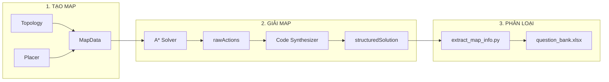

# Quy trình Tạo, Giải và Phân loại Màn chơi

Tài liệu mô tả chi tiết 3 giai đoạn chính trong pipeline xử lý màn chơi.

---

## 📊 Tổng quan Pipeline



---

## 📁 Nguồn Gốc Map Ideas (Data Sources)

### Pipeline Dữ Liệu

```
data/0_source/                          ← ⭐ INPUT GỐC
├── curriculum_source_*.xlsx            # Excel định nghĩa challenges
└── question_bank.xlsx                  # Question bank reference

    ↓ (Step 1: process_curriculum.py)

data/1_processed/                       
├── *_processed.xlsx                    # Processed & enriched data
└── *_with_difficulty.xlsx              # Added difficulty scores

    ↓ (Step 2: generate_curriculum.py)

data/2_generated_curriculum/
├── commands_*/curriculum.json          # Curriculum JSON config
└── functions_*/curriculum.json

    ↓ (Step 3: generate_all_maps.py)

data/3_generated_levels/
├── solvable/*.json                     # ✓ Maps có lời giải
└── unsolvable/*.json                   # ✗ Maps không giải được
```

---

### 📊 Chi tiết File Excel: `curriculum_source_*.xlsx`

#### Sheet "Curriculum" - Cấu trúc Columns

| # | Column | Type | Required | Mô tả | Ví dụ |
|---|--------|------|----------|-------|-------|
| 1 | `topic` | string | ✓ | Chủ đề chính | "Giới thiệu", "Vòng lặp" |
| 2 | `lesson` | string | ✓ | Bài học | "Bài 1: Di chuyển cơ bản" |
| 3 | `challenge` | string | ✓ | Tên challenge | "Challenge 1" |
| 4 | `skill_code` | string | ✓ | Mã kỹ năng | `G312.CODING_COMMANDS.MOVEMENT` |
| 5 | `logic_type` | string | ✓ | Kiểu logic cho code synthesis | `sequencing`, `for_loop`, `function` |
| 6 | `map_type` | string | ✓ | Tên topology | `l_shape`, `zigzag`, `staircase_3d` |
| 7 | `params` | string | | Tham số dạng key:value | `path_length:6;items_count:3` |
| 8 | `toolbox_preset` | string | ✓ | Preset Blockly blocks | `commands_level1`, `loops_basic` |
| 9 | `variants` | int | | Số biến thể cần sinh | 3 |
| 10 | `difficulty_target` | string | | Độ khó mong muốn | `easy`, `medium`, `hard` |

#### Params String Format

```
# Simple values
path_length:6;items_count:3

# JSON objects  
asset_theme:{"ground":"grass","obstacle":"rock"}

# JSON arrays
items_to_place:["crystal","crystal","switch"]

# Combined
path_length:6;asset_theme:{"ground":"grass"};items_to_place:["crystal"]
```

---

### 🔧 Pipeline Scripts Chi Tiết

#### Step 1: `process_curriculum.py`
**Input**: `data/0_source/curriculum_source_*.xlsx`  
**Output**: `data/1_processed/*_processed.xlsx`, `*_with_difficulty.xlsx`

```python
# Chức năng chính:
1. Đọc file Excel source
2. Gọi skill_mapper.generate_core_skills() để assign skill codes
3. Thêm cột difficulty score dựa trên params
4. Xuất file đã enrich
```

#### Step 2: `generate_curriculum.py`
**Input**: `data/1_processed/*_with_difficulty.xlsx`  
**Output**: `data/2_generated_curriculum/<run_id>/curriculum.json`

```python
# Chức năng chính:
1. Đọc file Excel đã processed
2. Parse params string → dictionary (hỗ trợ JSON objects/arrays)
3. Group challenges theo topic/lesson
4. Xuất curriculum.json với cấu trúc:
   {
     "run_id": "...",
     "challenges": [
       {
         "id": "C1",
         "map_type": "l_shape",
         "logic_type": "sequencing",
         "params": {...},
         "toolbox_preset": "commands_level1"
       }
     ]
   }
```

#### Step 3: `generate_all_maps.py`
**Input**: `data/2_generated_curriculum/<run_id>/curriculum.json`  
**Output**: `data/3_generated_levels/solvable/*.json`

```python
# Chức năng chính (1100+ lines):
1. Đọc curriculum.json
2. Với mỗi challenge:
   a. Gọi MapGeneratorService.generate_map(map_type, logic_type, params)
   b. Gọi gameSolver.solve_level() để tìm lời giải
   c. Gọi synthesize_program() để tạo structuredSolution
   d. Rename procedures thành tên pedagogical
   e. Tạo XML Blockly từ solution
   f. Xuất file JSON hoàn chỉnh
3. Phân loại maps thành solvable/unsolvable
4. Tạo report tổng hợp
```

---

### 📋 Output JSON Structure

```json
{
  "id": "COMMANDS_G312_C1-var1",
  "gameConfig": {
    "type": "maze",
    "blocks": [...],
    "players": [...],
    "collectibles": [...],
    "finish": {...}
  },
  "solution": {
    "rawActions": ["moveForward", "moveForward", "collect"],
    "structuredSolution": {
      "main": [...],
      "procedures": {...}
    },
    "blocklyXML": "<xml>...</xml>"
  },
  "metadata": {
    "skill_code": "G312.CODING_COMMANDS",
    "logic_type": "sequencing",
    "map_type": "l_shape",
    "toolbox_preset": "commands_level1",
    "difficulty": 0.3
  }
}
```

---

### Kết hợp Source → Code

| Source (Data) | Code Component | Vai trò |
|---------------|----------------|---------|
| `map_type` | `topologies/*.py` | Định nghĩa hình dạng map |
| `logic_type` | `placements/*.py` | Đặt items/obstacles |
| `params` | `map_templates.py` | Preset configurations |
| `toolbox_preset` | `toolbox_presets.json` | Available Blockly blocks |

---


## 1. 🗺️ Tạo màn chơi (Map Generation)

### Files chính
- [service.py](file:///Users/tonypham/MEGA/WebApp/3d-quest-map-gen/src/map_generator/service.py) - MapGeneratorService
- [topologies/](file:///Users/tonypham/MEGA/WebApp/3d-quest-map-gen/src/map_generator/topologies) - Các kiểu địa hình
- [placements/](file:///Users/tonypham/MEGA/WebApp/3d-quest-map-gen/src/map_generator/placements) - Các chiến lược đặt vật phẩm

### Kiến trúc 2 giai đoạn

#### Giai đoạn 1: Topology (Cấu trúc đường đi)
Tạo ra `PathInfo` chứa:
- `start_pos`, `target_pos`: Điểm bắt đầu và kết thúc
- `path_coords`: Danh sách tọa độ đường đi
- `placement_coords`: Vị trí có thể đặt vật phẩm
- `obstacles`: Chướng ngại vật

| Topology | Mô tả | Ví dụ |
|----------|-------|-------|
| `simple_path` | Đường thẳng đơn giản | `/Users/.../topologies/simple_path.py` |
| `l_shape` | Hình chữ L | 1 góc rẽ |
| `staircase` | Bậc thang 3D | Có jump |
| `complex_maze` | Mê cung DFS | Thuật toán Randomized DFS |
| `plowing_field` | Lưới zigzag | Nested loops |
| `swift_playground_maze` | Mê cung nhiều tầng | 3D platforms |

#### Giai đoạn 2: Placer (Đặt vật phẩm)
Nhận `PathInfo` và thêm:
- `items`: Crystals, switches
- `obstacles`: Tường nhảy

| Placer | Logic | Use case |
|--------|-------|----------|
| `obstacle_placer` | Đặt obstacle để buộc jump | Commands L3+ |
| `sequencing_placer` | Đặt nhiều loại item theo thứ tự | Multi-objective |
| `function_placer` | Tối ưu cho pattern recognition | Functions topic |
| `algorithm_placer` | Bài toán tìm kiếm/tối ưu | Algorithms topic |

### Code Example: Sinh map

```python
from src.map_generator.service import MapGeneratorService

service = MapGeneratorService()

# Sinh một map đơn lẻ
map_data = service.generate_map(
    map_type='l_shape',
    logic_type='sequencing',
    params={'path_length': 6, 'items_to_place': ['crystal', 'switch']}
)

# Sinh nhiều biến thể
for variant in service.generate_map_variants(
    map_type='complex_maze',
    logic_type='algorithm',
    params={'maze_width': [5, 10], 'maze_depth': [5, 10]},
    max_variants=10
):
    print(variant.start_pos, variant.target_pos)
```

---

## 2. 🧩 Giải màn chơi (Solving)

### Files chính
- [gameSolver.py](file:///Users/tonypham/MEGA/WebApp/3d-quest-map-gen/scripts/gameSolver.py) - Core solver

### Kiến trúc Solver

```
GameWorld → GameState → A* Solver → rawActions → Code Synthesizer → structuredSolution
```

#### Classes chính

| Class | Mô tả |
|-------|-------|
| `GameWorld` | Đọc JSON, xây dựng world_map, collectibles, switches |
| `GameState` | Snapshot trạng thái: vị trí, hướng, items đã thu, switch states |
| `PathNode` | Node cho A* với g_cost, h_cost, parent |

#### Thuật toán A* (`solve_level`)

```python
def solve_level(world: GameWorld) -> List[Action]:
    """
    1. Khởi tạo open_list với start_node
    2. Lặp:
       - Pop node có f_cost thấp nhất
       - Kiểm tra goal (về đích + hoàn thành itemGoals)
       - Expand neighbors (moveForward, turn, jump, collect, toggleSwitch)
       - Thêm vào open_list nếu chưa visited
    3. Trả về path (rawActions)
    """
```

**Heuristic:**
```python
h = manhattan(current_pos, finish_pos) + len(uncollected_items) * 5
```

**Các hành động có thể:**
| Action | Điều kiện |
|--------|-----------|
| `moveForward` | Có ground phía trước, không có obstacle |
| `turnLeft/Right` | Luôn có thể |
| `jump` | Có obstacle có thể nhảy LÊN hoặc có thể nhảy XUỐNG |
| `collect` | Đang đứng trên collectible chưa thu |
| `toggleSwitch` | Đang đứng trên switch |

#### Output: rawActions

```json
["turnRight", "moveForward", "moveForward", "collect", "turnLeft", "moveForward"]
```

---

### Code Synthesis (`synthesize_program`)

Chuyển `rawActions` thành `structuredSolution`:

#### Bước 1: Phát hiện Functions
```python
find_most_frequent_sequence(actions, min_len=2, max_len=10)
# → Tìm chuỗi lặp lại ≥2 lần để tạo PROCEDURE
```

#### Bước 2: Nén thành Loops
```python
compress_actions_to_structure(actions, available_blocks)
# → Phát hiện patterns liên tiếp để tạo maze_repeat
```

#### Output: structuredSolution

```json
{
  "main": [
    {"type": "maze_turn", "direction": "turnRight"},
    {"type": "CALL", "name": "PROCEDURE_1"},
    {"type": "maze_moveForward"},
    {"type": "maze_turn", "direction": "turnRight"},
    {"type": "CALL", "name": "PROCEDURE_1"},
    {"type": "maze_moveForward"}
  ],
  "procedures": {
    "PROCEDURE_1": [
      {"type": "maze_moveForward"},
      {"type": "maze_moveForward"},
      {"type": "maze_moveForward"}
    ]
  }
}
```

### Code Example: Giải map

```python
from scripts.gameSolver import solve_map_and_get_solution

with open('level.json') as f:
    level_data = json.load(f)

solution = solve_map_and_get_solution(level_data)
# Returns:
# {
#   "block_count": 11,
#   "raw_actions": ["turnRight", "moveForward", ...],
#   "structuredSolution": {"main": [...], "procedures": {...}}
# }
```

---

## 3. 📊 Phân loại và Đánh giá

### Files chính
- [extract_map_info.py](file:///Users/tonypham/MEGA/WebApp/3d-quest-map-gen/scripts/extract_map_info.py) - Trích xuất metadata
- [skill_mapper.py](file:///Users/tonypham/MEGA/WebApp/3d-quest-map-gen/scripts/skill_mapper.py) - Gán skill codes

### Các metrics trích xuất

| Metric | Nguồn | Ý nghĩa |
|--------|-------|---------|
| `rawActionsCount` | `len(rawActions)` | Số hành động thực thi |
| `optimalBlocks` | `block_count` từ solver | Số blocks Blockly tối ưu |
| `optimalLines` | `calculate_optimal_lines()` | LLOC |
| `crystalCount` | `itemGoals.crystal` | Số crystal cần thu |
| `switchCount` | `itemGoals.switch` | Số switch cần bật |
| `obstacleCount` | `len(obstacles)` | Số chướng ngại vật |
| `required_concepts` | `detect_required_concepts()` | Kiến thức cần áp dụng |

### Logic phân loại (`detect_required_concepts`)

```python
def detect_required_concepts(data):
    concepts = {"COMMANDS"}  # Luôn có
    
    # Từ toolboxPresetKey
    if 'functions' in preset: concepts.add("FUNCTIONS")
    if 'loops' in preset: concepts.add("FOR_LOOPS")
    if 'while' in preset: concepts.add("WHILE_LOOPS")
    
    # Từ structuredSolution
    if procedures: concepts.add("FUNCTIONS")
    for block in main:
        if 'repeat' in block.type: concepts.add("FOR_LOOPS")
        if 'if' in block.type: concepts.add("CONDITIONALS")
    
    return sorted(concepts)
```

### Workflow đầy đủ

```bash
# 1. Sinh maps
python3 scripts/generate_all_maps.py

# 2. Trích xuất và phân loại
python3 scripts/extract_map_info.py

# 3. Kết quả → data/0_source/question_bank.xlsx
```

---

## 📎 Files liên quan

| File | Mô tả |
|------|-------|
| [generate_all_maps.py](file:///Users/tonypham/MEGA/WebApp/3d-quest-map-gen/scripts/generate_all_maps.py) | Script sinh hàng loạt maps |
| [refine_and_solve.py](file:///Users/tonypham/MEGA/WebApp/3d-quest-map-gen/scripts/refine_and_solve.py) | Tinh chỉnh và giải lại maps |
| [update_final_maps_metrics.py](file:///Users/tonypham/MEGA/WebApp/3d-quest-map-gen/scripts/update_final_maps_metrics.py) | Cập nhật metrics cho maps đã có |
| [master_mapping_rules.py](file:///Users/tonypham/MEGA/WebApp/3d-quest-map-gen/scripts/master_mapping_rules.py) | Quy tắc mapping skill codes |
