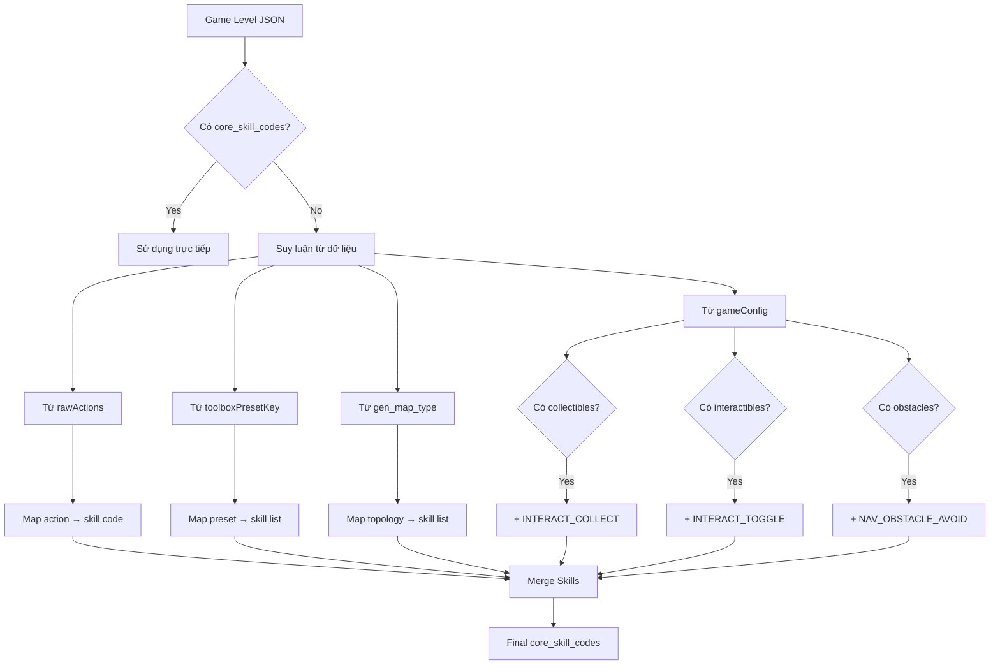

# Tài liệu Tham chiếu Metadata - Hệ thống Sinh Map Game Level

Tài liệu này tổng hợp tất cả các metadata, loại kiến thức, loại màn chơi và quy tắc mapping được sử dụng trong hệ thống sinh map tự động.

---

## 📋 Mục lục

1. [Skill Codes (Mã Kỹ năng)](#1-skill-codes-mã-kỹ-năng)
2. [Toolbox Presets](#2-toolbox-presets)
3. [Map Types (Loại Topology)](#3-map-types-loại-topology)
4. [Challenge Types](#4-challenge-types)
5. [Bloom's Taxonomy Codes](#5-blooms-taxonomy-codes)
6. [Knowledge Dimension Codes](#6-knowledge-dimension-codes)
7. [Context Codes](#7-context-codes)
8. [Difficulty Codes](#8-difficulty-codes)
9. [Block Types (Blockly)](#9-block-types-blockly)
10. [Mapping Rules](#10-mapping-rules)

---

## 1. Skill Codes (Mã Kỹ năng)

> Nguồn: [master_mapping_rules.py](file:///Users/tonypham/MEGA/WebApp/3d-quest-map-gen/scripts/master_mapping_rules.py)

### T1: Commands & Sequencing

| Code | Mô tả | Khi nào áp dụng |
|------|-------|-----------------|
| `CMD_EXECUTION_MOVE` | Giới thiệu lệnh di chuyển | Bài đầu tiên về moveForward |
| `CMD_EXECUTION_TURN` | Giới thiệu lệnh rẽ | Bài đầu tiên về turn |
| `CMD_EXECUTION_JUMP` | Giới thiệu lệnh nhảy | Bài đầu tiên về jump |
| `CMD_EXECUTION_COLLECT` | Giới thiệu thu thập | Bài đầu tiên về collect |
| `CMD_EXECUTION_TOGGLE` | Giới thiệu công tắc | Bài đầu tiên về toggle |
| `CMD_MOVE_FORWARD` | Sử dụng moveForward | Mọi bài có di chuyển thẳng |
| `CMD_TURN` | Sử dụng turn | Bài có rẽ trái/phải |
| `CMD_JUMP` | Sử dụng jump | Bài có nhảy lên/xuống |
| `INTERACT_COLLECT` | Thu thập vật phẩm (crystal) | Có collectibles trong gameConfig |
| `INTERACT_TOGGLE` | Bật/tắt công tắc (switch) | Có interactibles trong gameConfig |
| `SEQ_PLANNING_SIMPLE` | Lập kế hoạch tuần tự đơn giản | challenge_type = SIMPLE_APPLY |
| `SEQ_PLANNING_COMPLEX` | Lập kế hoạch tuần tự phức tạp | challenge_type = COMPLEX_APPLY |
| `SPATIAL_ORIENTATION` | Định hướng không gian | Bài có nhiều lần rẽ |
| `SPATIAL_TURN_LEFT` | Rẽ trái | rawActions chứa turnLeft |
| `SPATIAL_TURN_RIGHT` | Rẽ phải | rawActions chứa turnRight |

### T2: Functions (No Params)

| Code | Mô tả |
|------|-------|
| `FUNC_INTRO_DEFINE` | Giới thiệu định nghĩa hàm |
| `FUNC_INTRO_CALL` | Giới thiệu gọi hàm |
| `FUNC_DEFINE_SIMPLE` | Định nghĩa hàm đơn giản |
| `FUNC_CALL` | Gọi hàm |
| `FUNC_REUSE` | Tái sử dụng hàm |
| `FUNC_DECOMPOSE` | Phân rã bài toán thành hàm |
| `PATT_RECOGNITION` | Nhận diện mẫu lặp |

### T3: For Loops

| Code | Mô tả |
|------|-------|
| `LOOP_INTRO_FOR` | Giới thiệu vòng lặp for |
| `LOOP_FOR_BASIC` | Lặp lệnh đơn |
| `LOOP_FOR_PATTERN` | Lặp một mẫu phức tạp (thường là hàm) |

### T4: Variables & Math

| Code | Mô tả |
|------|-------|
| `VAR_INTRO` | Giới thiệu biến số |
| `VAR_DECLARE` | Khai báo biến |
| `VAR_ASSIGN` | Gán giá trị |
| `VAR_MODIFY` | Thay đổi giá trị (change by) |
| `VAR_READ` | Đọc giá trị biến |
| `MATH_INTRO` | Giới thiệu phép toán |
| `MATH_BASIC_ARITHMETIC` | Phép cộng/trừ/nhân/chia |
| `MATH_COUNTING` | Đếm vật phẩm |

### T5: Conditionals

| Code | Mô tả |
|------|-------|
| `COND_INTRO_IF` | Giới thiệu câu lệnh If |
| `COND_IF` | Sử dụng If |
| `COND_IF_ELSE` | Sử dụng If-Else |
| `SENSE_PATH` | Cảm biến đường đi (is_path) |
| `SENSE_ITEM` | Cảm biến vật phẩm |
| `SENSE_SWITCH` | Cảm biến công tắc |
| `LOGIC_COMPARE` | So sánh (<, >, ==) |

### T6: Logical Operators

| Code | Mô tả |
|------|-------|
| `LOGIC_INTRO_OPS` | Giới thiệu AND/OR/NOT |
| `LOGIC_OP_AND` | Toán tử AND |
| `LOGIC_OP_OR` | Toán tử OR |
| `LOGIC_OP_NOT` | Toán tử NOT |

### T7: While Loops

| Code | Mô tả |
|------|-------|
| `LOOP_INTRO_WHILE` | Giới thiệu vòng lặp while |
| `LOOP_WHILE` | Sử dụng while |
| `LOOP_UNTIL_GOAL` | Repeat until goal (maze_forever) |

### T8: Algorithms

| Code | Mô tả |
|------|-------|
| `ALGO_MAZE_SOLVING` | Giải mê cung (right-hand rule) |
| `ALGO_OPTIMIZATION` | Tối ưu hóa lời giải |
| `ALGO_ANY` | Thuật toán bất kỳ |

### T9: Parameters

| Code | Mô tả |
|------|-------|
| `FUNC_INTRO_PARAMS` | Giới thiệu tham số |
| `FUNC_WITH_PARAMS_DEFINE` | Định nghĩa hàm có tham số |
| `FUNC_WITH_PARAMS_CALL` | Gọi hàm có tham số |

### Debugging Skills

| Code | Mô tả |
|------|-------|
| `DEBUG_SEQ_ORDER` | Sửa lỗi thứ tự lệnh |
| `DEBUG_CMD_MISSING` | Sửa lỗi thiếu lệnh |
| `DEBUG_CMD_EXTRA` | Sửa lỗi thừa lệnh |
| `DEBUG_CMD_INCORRECT` | Sửa lỗi sai lệnh |

---

## 2. Toolbox Presets

> Nguồn: [toolbox_presets.json](file:///Users/tonypham/MEGA/WebApp/3d-quest-map-gen/data/_core/toolbox_presets.json) và [README_TOOLBOX-PRESET.md](file:///Users/tonypham/MEGA/WebApp/3d-quest-map-gen/data/README_TOOLBOX-PRESET.md)

### TOPIC 1: COMMANDS
| Preset Key | Blocks có sẵn | Mục tiêu học |
|------------|---------------|--------------|
| `commands_l1_move` | moveForward | Hiểu khái niệm lệnh |
| `commands_l2_turn` | + turn | Đi và rẽ đơn giản |
| `commands_l3_jump` | + jump | Hoàn thiện di chuyển 3D |
| `commands_l4_collect` | + collect | Thu thập vật phẩm |
| `commands_l5_switch` | + toggle_switch | Cơ chế công tắc |
| `commands_l6_comprehensive` | All actions | Bài toán tổng hợp |

### TOPIC 2: FUNCTIONS
| Preset Key | Blocks có sẵn | Mục tiêu học |
|------------|---------------|--------------|
| `functions_l1_movement_only` | Movement + Procedure | Định nghĩa hàm cơ bản |
| `functions_l2_collect_gem` | + collect | Hàm thu thập |
| `functions_l3_toggle_switch` | + toggle_switch | Hàm công tắc |
| `functions_l4_comprehensive` | Full actions + Procedure | Tổng hợp |

### TOPIC 3: FOR LOOPS
| Preset Key | Blocks có sẵn | Mục tiêu học |
|------------|---------------|--------------|
| `loops_l1_basic_movement` | Movement + maze_repeat | Lặp di chuyển |
| `loops_l2_with_actions` | + Actions | Lặp hành động |
| `loops_l3_functions_integration` | + Procedure | Loop + Function |

### TOPIC 4: VARIABLES
| Preset Key | Blocks có sẵn | Mục tiêu học |
|------------|---------------|--------------|
| `variables_l1_basic_assignment` | Number + Variable | Gán biến |
| `variables_l2_calculation` | + Arithmetic | Tính toán |
| `variables_l3_game_data` | + item_count | Lấy dữ liệu game |
| `variables_comprehensive` | Full + Procedure | Tổng hợp |

### ÔN TẬP: MIXED BASIC
| Preset Key | Blocks có sẵn | Mục tiêu học |
|------------|---------------|--------------|
| `mixed_basic_patterns` | Loop + Function | Thiên về cấu trúc |
| `mixed_basic_full_integration` | Full T1-T4 | Thiên về dữ liệu |

### TOPIC 5: CONDITIONALS
| Preset Key | Blocks có sẵn | Mục tiêu học |
|------------|---------------|--------------|
| `conditionals_l1_movement_sensing` | controls_if + is_path | Kiểm tra đường |
| `conditionals_l2_interaction_sensing` | + is_item, is_switch | Kiểm tra vật thể |
| `conditionals_l3_variable_comparison` | + Compare (<, >, =) | So sánh biến |

### TOPIC 6: LOGIC OPERATORS
| Preset Key | Blocks có sẵn | Mục tiêu học |
|------------|---------------|--------------|
| `logic_ops_l1_negation` | NOT | Phủ định |
| `logic_ops_l2_and_or` | AND, OR | Kết hợp điều kiện |
| `logic_ops_full_complex` | Full Logic + Variable | Biểu thức phức tạp |

### TOPIC 7: WHILE LOOPS
| Preset Key | Blocks có sẵn | Mục tiêu học |
|------------|---------------|--------------|
| `while_l1_until_goal` | maze_forever | Repeat until goal |
| `while_l2_conditional_custom` | controls_whileUntil | Tự viết điều kiện |
| `while_l3_full_logic` | + Full Logic | While + Logic phức tạp |

### TOPIC 8: ALGORITHMS
| Preset Key | Blocks có sẵn | Mục tiêu học |
|------------|---------------|--------------|
| `algorithms_navigation_rules` | Pure Logic (no Math) | Tìm đường mê cung |
| `algorithms_full_solver` | Full Toolbox | Tối ưu hóa |

### TOPIC 9: PARAMETERS
| Preset Key | Blocks có sẵn | Mục tiêu học |
|------------|---------------|--------------|
| `parameters_l1_basic_math` | Math + Variable | Truyền số vào hàm |
| `parameters_full_generalization` | Full + Parameters | Tổng quát hóa |

---

## 3. Map Types (Loại Topology)

> Định nghĩa trong `by_map_type` của [master_mapping_rules.py](file:///Users/tonypham/MEGA/WebApp/3d-quest-map-gen/scripts/master_mapping_rules.py)

### Đường đi cơ bản (2D)
| Map Type | Mô tả | Kỹ năng yêu cầu |
|----------|-------|-----------------|
| `simple_path` | Đường thẳng đơn giản | CMD_MOVE_FORWARD |
| `straight_line` | Đường thẳng | CMD_MOVE_FORWARD |
| `l_shape` | Hình chữ L | CMD_TURN, SPATIAL_ORIENTATION |
| `u_shape` | Hình chữ U | CMD_TURN, SEQ_PLANNING_COMPLEX |
| `s_shape` | Hình chữ S | CMD_TURN, SEQ_PLANNING_COMPLEX |
| `z_shape` | Hình chữ Z | CMD_TURN, SEQ_PLANNING_COMPLEX |
| `t_shape` | Hình chữ T | CMD_TURN, SPATIAL_ORIENTATION |
| `v_shape` | Hình chữ V | CMD_TURN, SPATIAL_ORIENTATION |
| `h_shape` | Hình chữ H | CMD_TURN, SEQ_PLANNING_COMPLEX |
| `ef_shape` | Hình EF | CMD_TURN, SEQ_PLANNING_COMPLEX |

### Hình dạng pattern
| Map Type | Mô tả | Kỹ năng yêu cầu |
|----------|-------|-----------------|
| `triangle` | Tam giác | PATT_RECOGNITION |
| `square_shape` | Hình vuông | PATT_RECOGNITION, LOOP_FOR_PATTERN |
| `star_shape` | Hình sao | PATT_RECOGNITION, LOOP_FOR_PATTERN |
| `plus_shape` | Dấu cộng | PATT_RECOGNITION |
| `arrow_shape` | Mũi tên | SPATIAL_ORIENTATION |
| `zigzag` | Zic-zac | PATT_STAIRCASE |

### Map 3D (có jump)
| Map Type | Mô tả | Kỹ năng yêu cầu |
|----------|-------|-----------------|
| `staircase` | Cầu thang | CMD_JUMP, PATT_STAIRCASE |
| `staircase_3d` | Cầu thang 3D | SPATIAL_REASONING_3D |
| `spiral_3d` | Xoắn ốc 3D | SPATIAL_REASONING_3D, ALGO_SPIRAL_TRAVERSAL |
| `hub_with_stepped_islands` | Hub với đảo bậc thang | NAV_COMPLEX |
| `stepped_island_clusters` | Cụm đảo bậc thang | SPATIAL_REASONING_3D |
| `symmetrical_islands` | Đảo đối xứng | PATT_RECOGNITION |
| `plus_shape_islands` | Đảo hình + | PATT_RECOGNITION |

### Mê cung và Map phức tạp
| Map Type | Mô tả | Kỹ năng yêu cầu |
|----------|-------|-----------------|
| `complex_maze_2d` | Mê cung 2D | ALGO_MAZE_SOLVING |
| `swift_playground_maze` | Mê cung Swift Playground | ALGO_MAZE_SOLVING |
| `grid` | Lưới ô vuông | NAV_GRID_TRAVERSAL, LOOP_WHILE |
| `grid_with_holes` | Lưới có lỗ | COND_IF |
| `plowing_field` | Cày ruộng | NAV_GRID_TRAVERSAL, LOOP_WHILE |
| `interspersed_path` | Đường rải | COND_IF |
| `spiral_path` | Xoắn ốc 2D | ALGO_SPIRAL_TRAVERSAL, VAR_MODIFY |

---

## 4. Challenge Types

| Type | Mô tả | Skill mapping |
|------|-------|---------------|
| `SIMPLE_APPLY` | Áp dụng kiến thức đơn giản | SEQ_PLANNING_SIMPLE |
| `COMPLEX_APPLY` | Áp dụng kiến thức phức tạp | SEQ_PLANNING_COMPLEX |
| `DEBUG_FIX_SEQUENCE` | Sửa lỗi thứ tự lệnh | DEBUG_SEQ_ORDER |
| `DEBUG_FIX_LOGIC` | Sửa lỗi logic | DEBUG_LOGIC |

---

## 5. Bloom's Taxonomy Codes

| Code | Level | Mô tả |
|------|-------|-------|
| `REMEMBER` | 1 | Nhớ - Nhận biết, liệt kê |
| `UNDERSTAND` | 2 | Hiểu - Giải thích, tóm tắt |
| `APPLY` | 3 | Áp dụng - Sử dụng kiến thức đã học |
| `ANALYZE` | 4 | Phân tích - Chia nhỏ, so sánh |
| `EVALUATE` | 5 | Đánh giá - Phê bình, kiểm định |
| `CREATE` | 6 | Sáng tạo - Thiết kế, phát minh |

---

## 6. Knowledge Dimension Codes

| Code | Mô tả | Ví dụ |
|------|-------|-------|
| `FACTUAL` | Kiến thức sự kiện | Tên các khối lệnh |
| `CONCEPTUAL` | Kiến thức khái niệm | Khái niệm vòng lặp, điều kiện |
| `PROCEDURAL` | Kiến thức thủ tục | Cách viết hàm, cách dùng if-else |
| `METACOGNITIVE` | Kiến thức siêu nhận thức | Chiến lược giải quyết vấn đề |

---

## 7. Context Codes

| Code | Mô tả |
|------|-------|
| `SEQUENTIAL_EXECUTION` | Thực thi tuần tự |
| `FUNCTION_USAGE` | Sử dụng hàm |
| `PATTERN_RECOGNITION` | Nhận diện mẫu |
| `LOOP_OPTIMIZATION` | Tối ưu bằng vòng lặp |
| `VARIABLE_TRACKING` | Theo dõi biến |
| `DECISION_MAKING` | Ra quyết định (if/else) |
| `LOGICAL_REASONING` | Suy luận logic |
| `ALGORITHM_APPLICATION` | Áp dụng thuật toán |

---

## 8. Difficulty Codes

### Intrinsic Difficulty (Độ khó nội tại)
| Code | Điểm | Mô tả |
|------|------|-------|
| `EASY` | 1-2 | Đường thẳng, ít bước |
| `MEDIUM` | 3-4 | Có rẽ, có thu thập |
| `HARD` | 5-6 | Nhiều rẽ, nhiều mục tiêu |
| `EXPERT` | 7+ | Mê cung, thuật toán |

### Perceived Difficulty Score
| Score | Label | Mô tả |
|-------|-------|-------|
| 1-3 | Easy | Người mới |
| 4-6 | Medium | Có kinh nghiệm |
| 7-8 | Hard | Thử thách |
| 9-10 | Expert | Chuyên gia |

---

## 9. Block Types (Blockly)

### Movement Category
| Block Type | Lệnh | Skill |
|------------|------|-------|
| `maze_moveForward` | Di chuyển thẳng | CMD_MOVE_FORWARD |
| `maze_turn` | Rẽ trái/phải | CMD_TURN |
| `maze_jump` | Nhảy | CMD_JUMP |

### Actions Category
| Block Type | Lệnh | Skill |
|------------|------|-------|
| `maze_collect` | Thu thập crystal | INTERACT_COLLECT |
| `maze_toggle_switch` | Bật/tắt switch | INTERACT_TOGGLE |

### Loops Category
| Block Type | Lệnh | Skill |
|------------|------|-------|
| `maze_repeat` | Lặp n lần | LOOP_FOR_BASIC |
| `controls_whileUntil` | While/Until | LOOP_WHILE |
| `maze_forever` | Repeat until goal | LOOP_UNTIL_GOAL |

### Logic Category
| Block Type | Lệnh | Skill |
|------------|------|-------|
| `controls_if` | If/Else | COND_IF |
| `maze_is_path` | Kiểm tra đường | SENSE_PATH |
| `maze_is_item_present` | Kiểm tra vật phẩm | SENSE_ITEM |
| `maze_is_switch_state` | Kiểm tra switch | SENSE_SWITCH |
| `maze_at_finish` | Kiểm tra đích | SENSE_GOAL |
| `logic_compare` | So sánh | LOGIC_COMPARE |
| `logic_operation` | AND/OR | LOGIC_OP_AND/OR |
| `logic_negate` | NOT | LOGIC_OP_NOT |

### Variables Category
| Block Type | Lệnh | Skill |
|------------|------|-------|
| `variables_set` | Gán biến | VAR_ASSIGN |
| `variables_get` | Đọc biến | VAR_READ |
| `math_change` | Thay đổi biến | VAR_MODIFY |

### Math Category
| Block Type | Lệnh | Skill |
|------------|------|-------|
| `math_number` | Số | - |
| `math_arithmetic` | +, -, *, / | MATH_BASIC_ARITHMETIC |
| `maze_item_count` | Đếm vật phẩm | MATH_COUNTING |

### Procedures Category
| Block Type | Lệnh | Skill |
|------------|------|-------|
| `procedures_defnoreturn` | Định nghĩa hàm | FUNC_DEFINE_SIMPLE |
| `procedures_callnoreturn` | Gọi hàm | FUNC_CALL |

---

## 10. Mapping Rules

### Quy tắc suy luận Skill từ dữ liệu

### Mapping từ rawActions

| Action | Skill Code |
|--------|------------|
| `moveForward` | `CMD_MOVE_FORWARD` |
| `turnLeft` | `CMD_TURN`, `SPATIAL_TURN_LEFT` |
| `turnRight` | `CMD_TURN`, `SPATIAL_TURN_RIGHT` |
| `jump` | `CMD_JUMP` |
| `collect` | `INTERACT_COLLECT` |
| `toggleSwitch` | `INTERACT_TOGGLE` |

---

## 📎 Tài liệu liên quan

- [GAME_LEVEL_STRUCTURE_ANALYSIS.md](file:///Users/tonypham/MEGA/WebApp/3d-quest-map-gen/instructions/GAME_LEVEL_STRUCTURE_ANALYSIS.md) - Phân tích cấu trúc JSON
- [ENHANCE_EXTRACT_MAP_INFO_KNOWLEDGE.md](file:///Users/tonypham/MEGA/WebApp/3d-quest-map-gen/instructions/proposals/ENHANCE_EXTRACT_MAP_INFO_KNOWLEDGE.md) - Đề xuất nâng cấp script
- [README_TOOLBOX-PRESET.md](file:///Users/tonypham/MEGA/WebApp/3d-quest-map-gen/data/README_TOOLBOX-PRESET.md) - Tài liệu Toolbox gốc
