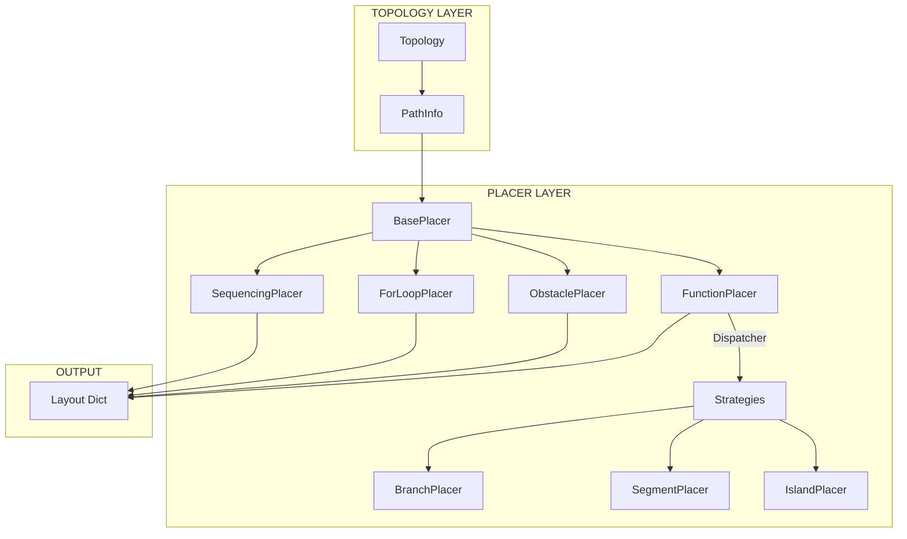
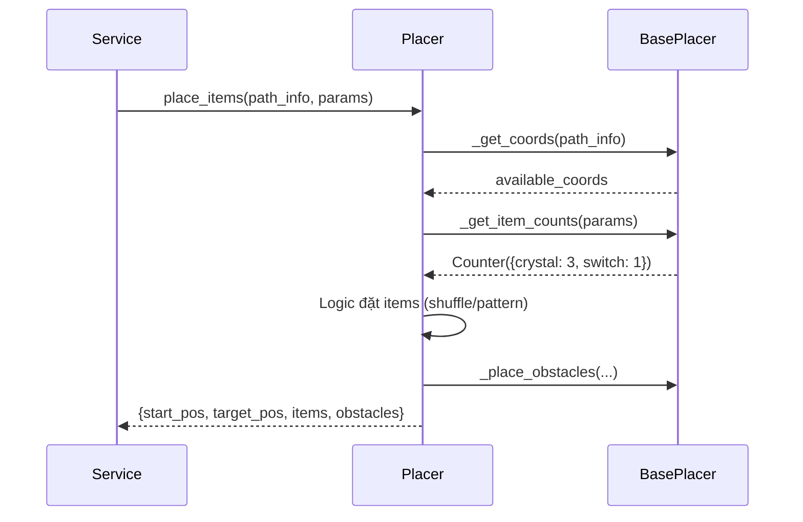

# Phân Tích Chi Tiết Cơ Chế Placer

Tài liệu mô tả kiến trúc và logic hoạt động của hệ thống Placer dùng để đặt vật phẩm và chướng ngại vật trong map.

---

## 📊 Tổng Quan Kiến Trúc



### Mô hình 2 Tầng

| Tầng | Input | Output | Vai trò |
|------|-------|--------|---------|
| **Topology** | `grid_size`, `params` | `PathInfo` | Tạo cấu trúc đường đi |
| **Placer** | `PathInfo`, `params` | `Layout Dict` | Đặt items, obstacles lên đường đi |

---

## 📁 Cấu Trúc Thư Mục

```
src/map_generator/placements/
├── __init__.py
├── base_placer.py              # 🔑 Lớp cơ sở với 12 helper methods
├── sequencing_placer.py        # Đặt theo logic tuần tự
├── for_loop_placer.py          # Đặt theo quy luật lặp
├── obstacle_placer.py          # Đặt chướng ngại vật (jump)
├── function_placer.py          # 🔑 Dispatcher ủy quyền cho strategies
├── algorithm_placer.py         # Cho bài toán thuật toán
├── variable_placer.py          # Sử dụng biến
├── while_if_placer.py          # While loop + conditionals
├── command_obstacle_placer.py  # Fallback placer
├── *_shape_placer.py           # Các shape-specific placers (10+ files)
└── strategies/                 # Các chiến lược con
    ├── base_strategy.py
    ├── branch_placer_strategy.py
    ├── segment_placer_strategy.py
    ├── island_placer_strategy.py
    ├── parameter_shape_strategy.py
    └── complex_structure_strategy.py
```

---

## 🔑 BasePlacer - Lớp Cơ Sở

File: [base_placer.py](file:///Users/tonypham/MEGA/WebApp/3d-quest-map-gen/src/map_generator/placements/base_placer.py)

### Interface Chính

```python
class BasePlacer(ABC):
    @abstractmethod
    def place_items(self, path_info: PathInfo, params: dict) -> dict:
        """Trả về layout dict với start_pos, target_pos, items, obstacles"""
        pass
    
    def place_item_variants(self, path_info, params, max_variants) -> Iterator[dict]:
        """Sinh nhiều biến thể layout"""
        pass
```

### 12 Helper Methods

| Method | Mục đích |
|--------|----------|
| `_get_coords()` | Lấy coords từ PathInfo (ưu tiên placement_coords) |
| `_exclude_ends()` | Loại bỏ start/target khỏi danh sách |
| `_base_layout()` | Tạo dict layout chuẩn |
| `_override_start_target()` | Cho phép placer ghi đè start/target |
| `_get_item_counts()` | Merge items_to_place + solution_item_goals |
| `_parse_goals()` | Parse "crystal:5; switch:1" → dict |
| `_handle_explicit_placements()` | Xử lý vị trí đặt tường minh từ params |
| `_place_obstacles()` | Đặt N obstacles vào vị trí trống |

### Output Format

```python
{
    "start_pos": (x, y, z),
    "target_pos": (x, y, z),
    "items": [
        {"type": "crystal", "pos": (x, y, z)},
        {"type": "switch", "pos": (x, y, z), "initial_state": "off"}
    ],
    "obstacles": [
        {"type": "obstacle", "pos": (x, y, z)}
    ]
}
```

---

## 🎯 Các Placer Chính

### 1. SequencingPlacer (Tuần Tự)

**Use case**: Bài học Commands cơ bản, thu thập items theo thứ tự.

```python
# Input params
params = {
    'items_to_place': ['crystal', 'crystal', 'switch'],
    'obstacle_count': 2
}
```

**Logic**:
1. Lấy `path_coords` (loại bỏ start/target)
2. Shuffle random các vị trí
3. Đặt obstacles trước
4. Đặt items vào các vị trí còn lại

**Đặc điểm**: Items được đặt **ngẫu nhiên**, không theo quy luật cố định.

---

### 2. ForLoopPlacer (Vòng Lặp)

**Use case**: Bài học về for loop, pattern recognition.

```python
# Input params
params = {
    'item_type': 'crystal',  # Loại item
    'item_count': 5          # Optional: số lượng (nếu không có → đặt hết)
}
```

**Logic**:
1. Lấy `placement_coords` (hoặc `path_coords`)
2. Nếu có `item_count`: random sample N vị trí
3. Nếu không: đặt item ở **TẤT CẢ** vị trí (cho nested loop)

**Đặc điểm**: Không đặt obstacles để học sinh tập trung vào pattern.

---

### 3. ObstaclePlacer (Chướng Ngại Vật)

**Use case**: Bài học về jump command.

```python
# Input params
params = {
    'obstacle_count': 3,     # Đặt N obstacles
    'obstacle_chance': 0.3,  # Hoặc đặt theo xác suất 30%
    'items_to_place': ['crystal']
}
```

**Logic**:
1. Kế thừa obstacles từ `path_info.obstacles`
2. Ưu tiên `placement_coords` cho obstacles (không chặn đường)
3. Đặt obstacles trước (theo count hoặc chance)
4. Đặt items vào vị trí còn lại

**Đặc điểm**: Obstacles đặt trên "đảo" để không chặn hoàn toàn đường đi.

---

### 4. FunctionPlacer (Dispatcher)

**Use case**: Bài học về Functions, pattern-based challenges.

**Kiến trúc Dispatcher**:
```
FunctionPlacer (Bộ điều phối)
├── Nhận map_type từ params
├── Tra cứu STRATEGY_MAP
├── Ủy quyền cho Strategy phù hợp
└── Fallback: CommandObstaclePlacer
```

**STRATEGY_MAP**:

| Strategy | Supported map_types |
|----------|---------------------|
| `branch_placer` | h_shape, ef_shape, interspersed_path, plus_shape |
| `segment_placer` | square_shape, staircase, star_shape, zigzag, triangle |
| `island_placer` | symmetrical_islands, plus_shape_islands |
| `parameter_shape` | grid, l_shape, u_shape, s_shape |
| `complex_structure` | complex_maze_2d, swift_playground_maze, hub_with_stepped_islands |

---

## 🧩 Strategies Sub-package

### Mục đích
Tách logic phức tạp của FunctionPlacer thành các module chuyên biệt.

### Base Strategy Interface

```python
class BaseFunctionStrategy:
    def place(self, path_info, params) -> (items, obstacles):
        raise NotImplementedError
    
    # Helper methods
    def _get_challenge_type(params) -> str
    def _get_item_counts(params) -> Counter
    def _parse_goals(s) -> dict
    def _place_obstacles(path_info, coords, used, count) -> list
```

### Strategy Files

| File | Đặc điểm |
|------|----------|
| `branch_placer_strategy.py` | Xử lý paths có nhiều nhánh |
| `segment_placer_strategy.py` | Chia path thành segments, đặt theo từng segment |
| `island_placer_strategy.py` | Đặt items trên các "đảo" riêng biệt |
| `parameter_shape_strategy.py` | Đặt items theo hình dạng (grid, L, U, S) |
| `complex_structure_strategy.py` | Xử lý mazes và cấu trúc phức tạp |

---

## 🔄 Workflow Đặt Items



---

## 📊 Bảng So Sánh Placers

| Placer | Items | Obstacles | Random | Pattern | Use Case |
|--------|-------|-----------|--------|---------|----------|
| **SequencingPlacer** | ✅ | ✅ | ✅ | ❌ | Commands cơ bản |
| **ForLoopPlacer** | ✅ | ❌ | ⚠️ | ✅ | For loops |
| **ObstaclePlacer** | ✅ | ✅✅ | ✅ | ❌ | Jump commands |
| **FunctionPlacer** | ✅ | ✅ | ✅ | ✅ | Functions |
| **AlgorithmPlacer** | ✅ | ⚠️ | ✅ | ✅ | Algorithms |
| **VariablePlacer** | ✅ | ❌ | ❌ | ✅ | Variables |
| **WhileIfPlacer** | ✅ | ✅ | ⚠️ | ✅ | While + If |

Legend: ✅ = Supported, ✅✅ = Primary focus, ⚠️ = Limited, ❌ = Not used

---

## 📝 Params Thường Dùng

| Param | Type | Mô tả | Example |
|-------|------|-------|---------|
| `items_to_place` | list/str | Items cần đặt | `['crystal', 'switch']` |
| `obstacle_count` | int | Số obstacles cố định | `3` |
| `obstacle_chance` | float | Xác suất đặt obstacle | `0.3` |
| `item_type` | str | Loại item mặc định | `'crystal'` |
| `item_count` | int | Số items cần đặt | `5` |
| `solution_item_goals` | str | Goals format | `'crystal:5; switch:1'` |
| `map_type` | str | Cho FunctionPlacer dispatch | `'l_shape'` |

---

## 🎓 Ví Dụ Sử Dụng

### 1. Đặt 3 crystals ngẫu nhiên

```python
placer = SequencingPlacer()
layout = placer.place_items(path_info, {
    'items_to_place': ['crystal', 'crystal', 'crystal']
})
```

### 2. Đặt crystals theo pattern (tất cả vị trí)

```python
placer = ForLoopPlacer()
layout = placer.place_items(path_info, {
    'item_type': 'crystal'
    # Không có item_count → đặt hết
})
```

### 3. Đặt obstacles + items

```python
placer = ObstaclePlacer()
layout = placer.place_items(path_info, {
    'obstacle_count': 2,
    'items_to_place': ['crystal', 'switch']
})
```

### 4. Sử dụng FunctionPlacer với strategy

```python
placer = FunctionPlacer()
layout = placer.place_items(path_info, {
    'map_type': 'l_shape',  # → parameter_shape_strategy
    'items_to_place': ['crystal', 'crystal']
})
```

---

## 🔗 Files Liên Quan

| File | Mô tả |
|------|-------|
| [service.py](file:///Users/tonypham/MEGA/WebApp/3d-quest-map-gen/src/map_generator/service.py) | Chọn và gọi placer |
| [path_info.py](file:///Users/tonypham/MEGA/WebApp/3d-quest-map-gen/src/map_generator/models/path_info.py) | Model PathInfo |
| [topologies/](file:///Users/tonypham/MEGA/WebApp/3d-quest-map-gen/src/map_generator/topologies) | Sinh PathInfo |

---

*Phân tích tạo ngày: 2024-12-16*
