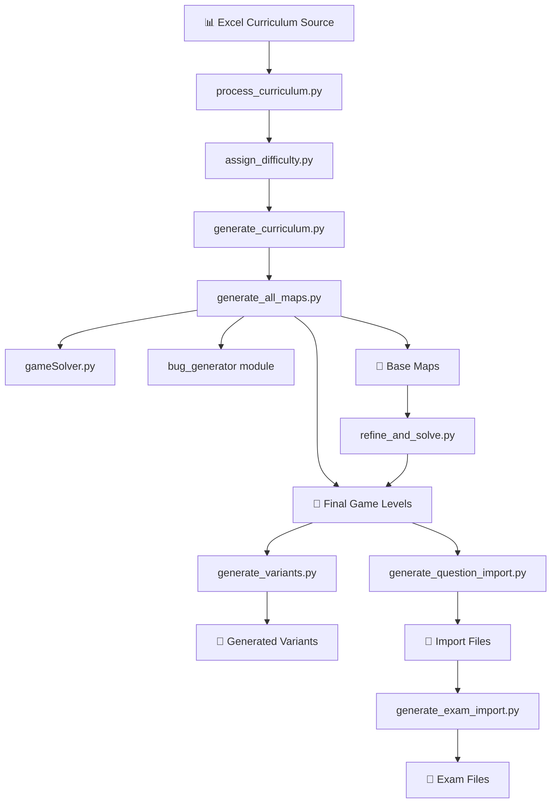
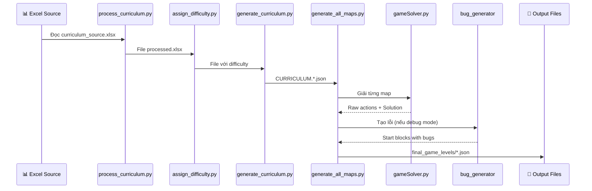

# 3D Quest Map Generation System - Script Analysis Report

Báo cáo này phác thảo chức năng của toàn bộ workflow, các scripts và các file input/output liên quan trong hệ thống sinh map tự động.

---

## 📊 Tổng quan hệ thống

Dự án là một **pipeline tự động hóa mạnh mẽ** để sinh ra các màn chơi (game levels) cho một trò chơi giáo dục lập trình. Hệ thống chuyển đổi định nghĩa màn chơi từ file Excel thành các file game level JSON hoàn chỉnh.

### Kiến trúc tổng quan



---

## 📁 Cấu trúc thư mục dữ liệu

| Thư mục | Mô tả | Files mẫu |
|---------|-------|-----------|
| `data/0_source/` | File Excel nguồn curriculum | `curriculum_source_*.xlsx` |
| `data/1_processed/` | Curriculum đã xử lý và gán độ khó | `*.xlsx` |
| `data/2_generated_curriculum/` | File JSON curriculum đã tạo | `CURRICULUM.*.json` |
| `data/3_generated_levels/` | Map levels đã sinh (~2021 files) | `*.json` |
| `data/4_generated_variants/` | Các biến thể map | `*.json` |
| `data/5_reports/` | Báo cáo Excel | `*.xlsx` |
| `data/6_import_files/` | Files import cho hệ thống | `*.json` |
| `data/final_game_levels/` | Map hoàn thiện cuối cùng | `*.json` |
| `data/exams/` | File đề thi | `exam-import.json` |

---

## 🔄 Workflow chính

### Quy trình 1: Sinh Map Hàng loạt từ Curriculum



### Quy trình 2: Tinh chỉnh Map Thủ công

1. Chỉnh sửa file `BASEMAP.*.json` bằng Map Builder
2. Chạy `refine_and_solve.py` để cập nhật lời giải
3. File được cập nhật trong `final_game_levels/`

---

## 📜 Danh sách Scripts Chi tiết

### 🎯 Scripts Điều phối Chính

#### [`main.py`](file:///Users/tonypham/MEGA/WebApp/3d-quest-map-gen/main.py)
**Chức năng**: Điểm khởi chạy chính, điều phối toàn bộ pipeline sinh map.

| Input | Output |
|-------|--------|
| File Excel trong `data/0_source/` | Tất cả các file trong pipeline |

**Workflow thực thi**:
1. Gọi `process_curriculum.py` → xử lý Excel
2. Gọi `assign_difficulty.py` → gán độ khó
3. Gọi `generate_curriculum.py` → tạo JSON curriculum
4. Gọi `generate_all_maps.py` → sinh map
5. Gọi `generate_question_import.py` → tổng hợp import file

---

### 📥 Scripts Xử lý Curriculum

#### [`process_curriculum.py`](file:///Users/tonypham/MEGA/WebApp/3d-quest-map-gen/scripts/process_curriculum.py)
**Chức năng**: Bước tiền xử lý đầu tiên, đọc Excel, làm sạch dữ liệu và chuẩn bị cho các bước tiếp theo.

| Input | Output |
|-------|--------|
| `data/0_source/curriculum_source_*.xlsx` | `data/1_processed/*.xlsx` |

---

#### [`assign_difficulty.py`](file:///Users/tonypham/MEGA/WebApp/3d-quest-map-gen/scripts/assign_difficulty.py)
**Chức năng**: Gán độ khó (Intrinsic & Perceived) cho từng challenge dựa trên cấu trúc map và ngữ cảnh.

| Input | Output |
|-------|--------|
| `data/1_processed/*.xlsx` | File Excel với cột difficulty |

**Logic gán độ khó**:
- **Intrinsic Difficulty**: Easy/Medium/Hard/Expert dựa trên `gen_map_type`, `gen_params`
- **Perceived Difficulty**: 1-10 dựa trên ngữ cảnh (topic, exam_type)

---

#### [`generate_curriculum.py`](file:///Users/tonypham/MEGA/WebApp/3d-quest-map-gen/scripts/generate_curriculum.py)
**Chức năng**: Chuyển đổi Excel đã xử lý thành các file JSON curriculum có cấu trúc.

| Input | Output |
|-------|--------|
| File Excel đã xử lý | `data/2_generated_curriculum/CURRICULUM.*.json` |

---

### 🗺️ Scripts Sinh Map

#### [`generate_all_maps.py`](file:///Users/tonypham/MEGA/WebApp/3d-quest-map-gen/scripts/generate_all_maps.py) ⭐
**Chức năng**: Script trung tâm của pipeline, sinh ra các file game level cuối cùng.

| Input | Output |
|-------|--------|
| `CURRICULUM.*.json` | `data/3_generated_levels/*.json` |
| | `data/base_maps/BASEMAP.*.json` |
| | `data/final_game_levels/*.json` |

**Quy trình**:
1. Đọc file curriculum JSON
2. Sinh cấu trúc map (topology + placer)
3. Gọi `gameSolver.py` để tìm lời giải
4. Gọi `bug_generator` nếu là bài debug
5. Tạo XML Blockly từ lời giải
6. Lưu file level hoàn chỉnh

---

#### [`gameSolver.py`](file:///Users/tonypham/MEGA/WebApp/3d-quest-map-gen/scripts/gameSolver.py) ⭐
**Chức năng**: Engine cốt lõi để giải một màn chơi, sử dụng thuật toán A*.

| Input | Output |
|-------|--------|
| JSON game config | `rawActions`, `optimalBlocks`, `structuredSolution` |

**Components chính**:
- `GameWorld`: Mô hình hóa thế giới game từ JSON
- `GameState`: Trạng thái game tại một thời điểm
- `solve_level()`: Thuật toán A* tìm lời giải tối ưu
- `compress_actions_to_structure()`: Nén hành động thành cấu trúc loop/function

---

#### [`refine_and_solve.py`](file:///Users/tonypham/MEGA/WebApp/3d-quest-map-gen/scripts/refine_and_solve.py)
**Chức năng**: Tinh chỉnh và giải lại map đã được chỉnh sửa thủ công.

| Input | Output |
|-------|--------|
| `data/base_maps/BASEMAP.*.json` | `data/final_game_levels/*.json` |
| Curriculum JSON | Log file |

**Cách dùng**:
```bash
python3 scripts/refine_and_solve.py MAP_ID  # Single map
python3 scripts/refine_and_solve.py --all   # All maps
```

---

### 🔀 Scripts Tạo Biến thể

#### [`generate_variants.py`](file:///Users/tonypham/MEGA/WebApp/3d-quest-map-gen/scripts/generate_variants.py)
**Chức năng**: Sinh các file curriculum "biến thể" từ curriculum gốc.

| Input | Output |
|-------|--------|
| Curriculum JSON gốc | `data/curriculum_variants/*.json` |

**Chiến lược biến thể**:
- `_strat_dimension`: Thay đổi kích thước
- `_strat_placement`: Thay đổi vị trí vật phẩm/chướng ngại
- `_strat_topology`: Thay đổi cấu trúc

---

#### [`refine_and_generate_variants.py`](file:///Users/tonypham/MEGA/WebApp/3d-quest-map-gen/scripts/refine_and_generate_variants.py)
**Chức năng**: Công cụ mạnh mẽ để tinh chỉnh map và tạo biến thể trực tiếp từ gameConfig.

| Input | Output |
|-------|--------|
| Base map đã chỉnh sửa | Final levels + Variants |

**Transforms có thể**:
- Đổi theme
- Xoay map (90°, 180°, 270°)
- Đổi hướng player
- Thêm/bớt items
- Thêm/bớt obstacles

---

### 📤 Scripts Xuất Import Files

#### [`generate_question_import.py`](file:///Users/tonypham/MEGA/WebApp/3d-quest-map-gen/scripts/generate_question_import.py)
**Chức năng**: Tổng hợp tất cả game levels thành một file JSON để import vào hệ thống.

| Input | Output |
|-------|--------|
| `data/final_game_levels/*.json` | `data/6_import_files/questions-import.json` |
| Excel curriculum | |

---

#### [`generate_exam_import.py`](file:///Users/tonypham/MEGA/WebApp/3d-quest-map-gen/scripts/generate_exam_import.py)
**Chức năng**: Tạo file import đề thi từ ExamBlueprints.

| Input | Output |
|-------|--------|
| `data/ExamBlueprints.xlsx` | `data/exams/exam-import.json` |
| `questions-import.json` | |

---

#### [`generate_exam_variants.py`](file:///Users/tonypham/MEGA/WebApp/3d-quest-map-gen/scripts/generate_exam_variants.py)
**Chức năng**: Tạo nhiều bộ đề thi từ blueprint và question bank.

| Input | Output |
|-------|--------|
| Blueprint Excel | Variant Excel files |
| Question bank | |

---

#### [`generate_exam_import_from_variants.py`](file:///Users/tonypham/MEGA/WebApp/3d-quest-map-gen/scripts/generate_exam_import_from_variants.py)
**Chức năng**: Tạo file JSON import từ các file exam variants.

| Input | Output |
|-------|--------|
| Exam variant Excel files | `exam-import.json` |

---

### 🛠️ Scripts Tiện ích

#### [`skill_mapper.py`](file:///Users/tonypham/MEGA/WebApp/3d-quest-map-gen/scripts/skill_mapper.py)
**Chức năng**: Gán thẻ kỹ năng (`core_skills`) cho từng challenge.

| Input | Output |
|-------|--------|
| DataFrame với challenge data | List of skill codes |

---

#### [`master_mapping_rules.py`](file:///Users/tonypham/MEGA/WebApp/3d-quest-map-gen/scripts/master_mapping_rules.py)
**Chức năng**: Chứa tất cả quy tắc mapping để suy luận kỹ năng.

**Quy tắc bao gồm**:
- `by_text_keywords`: Quét tiêu đề/mô tả
- `by_challenge_type`: Theo loại challenge
- `by_map_type`: Theo topology
- `by_map_params`: Theo parameters
- `by_solution_goals`: Theo mục tiêu

---

#### [`calculate_lines.py`](file:///Users/tonypham/MEGA/WebApp/3d-quest-map-gen/scripts/calculate_lines.py)
**Chức năng**: Tính toán "Số dòng code logic" (LLOC) cho lời giải.

| Input | Output |
|-------|--------|
| `structuredSolution` dict | LLOC count |

---

#### [`check_duplicates_and_report.py`](file:///Users/tonypham/MEGA/WebApp/3d-quest-map-gen/scripts/check_duplicates_and_report.py)
**Chức năng**: Dọn dẹp file trùng lặp và tạo báo cáo.

| Input | Output |
|-------|--------|
| `data/final_game_levels/` | Cleaned folder + Excel report |

---

#### [`extract_map_info.py`](file:///Users/tonypham/MEGA/WebApp/3d-quest-map-gen/scripts/extract_map_info.py)
**Chức năng**: Trích xuất thông tin từ các file map và tổng hợp vào Excel.

| Input | Output |
|-------|--------|
| `data/final_game_levels/*.json` | Excel report |

---

#### [`copy_selected_maps.py`](file:///Users/tonypham/MEGA/WebApp/3d-quest-map-gen/scripts/copy_selected_maps.py)
**Chức năng**: Sao chép các map được chọn để review.

| Input | Output |
|-------|--------|
| List map IDs | `data/selected_maps_for_review/` |

---

#### [`update_final_maps_metrics.py`](file:///Users/tonypham/MEGA/WebApp/3d-quest-map-gen/scripts/update_final_maps_metrics.py)
**Chức năng**: Cập nhật hàng loạt các chỉ số của map đã hoàn thiện.

| Input | Output |
|-------|--------|
| Final game levels | Updated JSON with new metrics |

---

#### [`json_to_excel_curriculum.py`](file:///Users/tonypham/MEGA/WebApp/3d-quest-map-gen/scripts/json_to_excel_curriculum.py)
**Chức năng**: Quy trình ngược - chuyển JSON curriculum về Excel để rà soát.

| Input | Output |
|-------|--------|
| `data/curriculum/*.json` | `curriculum_reversed.xlsx` |

---

## 🧩 Modules trong `src/`

### `src/map_generator/`
Module chính sinh cấu trúc map, bao gồm:
- **Topologies**: 28+ loại cấu trúc map (straight_line, l_shape, complex_maze, spiral_3d, v.v.)
- **Placers**: Logic đặt vật phẩm và chướng ngại vật
- **Service**: Điều phối việc sinh map

### `src/bug_generator/`
Module tạo lỗi cho các bài debug:
- **Strategies**: Các chiến lược tạo lỗi (main_thread_bugs, control_flow_bugs)
- **Service**: Điều phối việc tạo lỗi

### `src/utils/`
Các tiện ích chung:
- `geometry.py`: Xử lý hình học
- `randomizer.py`: Random có seed

---

## 📋 Tóm tắt Input/Output

| Stage | Script chính | Input | Output |
|-------|-------------|-------|--------|
| 1️⃣ | `process_curriculum.py` | Excel nguồn | Excel đã xử lý |
| 2️⃣ | `assign_difficulty.py` | Excel xử lý | Excel + difficulty |
| 3️⃣ | `generate_curriculum.py` | Excel | JSON curriculum |
| 4️⃣ | `generate_all_maps.py` | JSON curriculum | Game levels |
| 5️⃣ | `generate_variants.py` | Levels | Biến thể |
| 6️⃣ | `generate_question_import.py` | Levels | Import JSON |
| 7️⃣ | `generate_exam_import.py` | Blueprint + Questions | Exam JSON |

---

## 🏃 Cách sử dụng

### Chạy toàn bộ pipeline
```bash
python3 main.py
```

### Chạy từng bước riêng lẻ
```bash
# Sinh curriculum JSON
python3 scripts/generate_curriculum.py

# Sinh tất cả map
python3 scripts/generate_all_maps.py

# Tinh chỉnh map
python3 scripts/refine_and_solve.py MAP_ID

# Tạo import file
python3 scripts/generate_question_import.py
```
