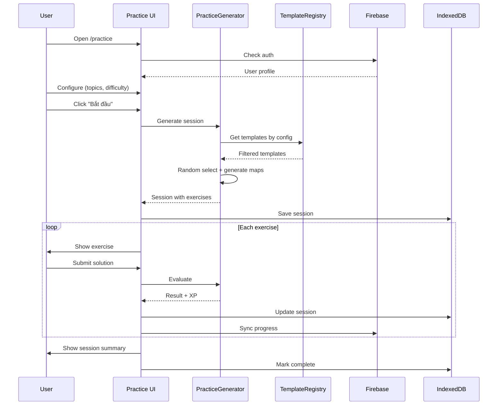

# Design: Practice Mode Architecture

## Context

Quest Player cần chế độ luyện tập cho phép người chơi tự chọn chủ đề và độ khó. Hệ thống cần:
- Kho template dùng chung giữa Builder và Player
- Authentication và lưu trữ tiến trình
- Sinh bài tập động từ templates

## Goals

- Tái sử dụng Template engine từ Builder
- Minimal backend dependency (Firebase free tier)
- Offline-first với local template fallback
- Type-safe template format

## Non-Goals

- Real-time multiplayer (Phase 2+)
- User-created templates (Phase 3)
- Advanced analytics dashboard

---

## Decision 1: Template Format

**Options considered:**
1. JSON files - Simple, no parsing
2. TypeScript modules - Type-safe, tree-shakeable
3. Markdown with frontmatter - Human-readable, git-friendly, notebook-compatible

**Decision:** Markdown with frontmatter + fenced code blocks

**Rationale:**
- Aligns với existing Notebook Editor UI
- Human-readable for manual editing
- YAML frontmatter cho metadata
- Code blocks cho executable JavaScript
- Dễ diff/review trong git

---

## Decision 2: Template Loading Strategy

**Strategy:** Local-first with remote override

```
┌─────────────────────────────────────────────────────────┐
│                    App Initialization                    │
├─────────────────────────────────────────────────────────┤
│                                                         │
│   1. Load bundled templates (guaranteed available)      │
│              ↓                                          │
│   2. Check Firebase connection                          │
│              ↓                                          │
│   ┌─────────┴─────────┐                                │
│   │ Connected?        │                                │
│   └─────────┬─────────┘                                │
│        Yes  │  No                                       │
│             ↓   ↓                                       │
│   Fetch remote  Use local only                          │
│        ↓                                                │
│   3. Merge: remote.version > local.version → override   │
│        ↓                                                │
│   4. Cache merged templates in memory                   │
│                                                         │
└─────────────────────────────────────────────────────────┘
```

---

## Decision 3: Firebase Collections

```
firestore/
├── users/{uid}/
│   ├── profile: {
│   │     displayName: string
│   │     photoURL: string
│   │     createdAt: Timestamp
│   │   }
│   ├── progress: {
│   │     [category: string]: {
│   │       xp: number
│   │       level: number
│   │       streak: number
│   │       lastActivity: Timestamp
│   │     }
│   │   }
│   └── sessions/{sessionId}: {
│         config: PracticeConfig
│         exercises: GeneratedExercise[]
│         currentIndex: number
│         results: ExerciseResult[]
│         startedAt: Timestamp
│         completedAt?: Timestamp
│       }
│
└── templates/{templateId}/ (Phase 2: remote templates)
    ├── metadata: { ... }
    └── content: string (markdown)
```

---

## Decision 4: Session Persistence

**Storage:** IndexedDB via Dexie.js

**Why IndexedDB over LocalStorage:**
- Larger quota (50MB+ vs 5MB)
- Async API (non-blocking)
- Structured data support
- Better for complex session objects

**Encoding:** Base64 (simple privacy, not security)

```typescript
// Schema
interface PracticeSessionDB {
  id: string;
  userId: string;
  config: string;        // base64(JSON)
  exercises: string;     // base64(JSON)
  currentIndex: number;
  results: string;       // base64(JSON)
  updatedAt: Date;
}
```

---

## Decision 5: Scoring Formula

```typescript
const calculateXP = (exercise: Exercise, result: ExerciseResult): number => {
  const baseXP = exercise.difficulty * 10;  // 10-100 XP
  
  // Time bonus: 30s par, max 60 bonus
  const parTime = 30;
  const timeBonus = Math.max(0, Math.min(60, (parTime - result.timeTaken) * 2));
  
  // Hint penalty: -5 XP per hint
  const hintPenalty = result.hintsUsed * 5;
  
  // Streak multiplier: +10% per streak, max 2x
  const streakMultiplier = Math.min(2, 1 + (result.currentStreak * 0.1));
  
  // First attempt bonus: +20 XP
  const firstAttemptBonus = result.attempts === 1 ? 20 : 0;
  
  return Math.floor(
    (baseXP + timeBonus - hintPenalty + firstAttemptBonus) * streakMultiplier
  );
};
```

**Level progression:** 100 XP per level (can adjust later)

---

## Risks & Mitigations

| Risk | Impact | Mitigation |
|------|--------|------------|
| Firebase quota exceeded | App breaks | Monitor usage, implement rate limiting |
| Template version mismatch | Wrong exercises | Include version in session data |
| IndexedDB unavailable | Session lost | Fallback to in-memory, warn user |
| Slow template parsing | Bad UX | Parse once, cache results |

---

## Open Questions (Resolved)

1. ~~Auth providers~~ → Google + Email/Password
2. ~~Template storage~~ → Local bundled + remote override
3. ~~Builder workflow~~ → Export → commit → Player uses
4. ~~Encryption~~ → Base64 for privacy

---

## Diagram: Practice Mode Flow


