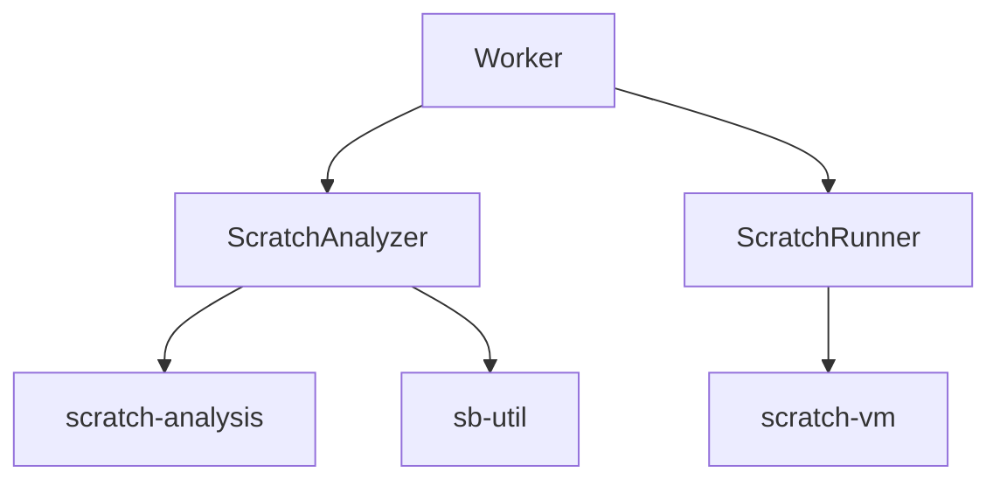

# Component: Scratch Analyzer Design

## Context
"Tin học trẻ" judging requires more than just testing input/output values. Structural constraints are often part of the scoring criteria (e.g., using specific blocks).

---

## Architecture


## Static Analysis (ScratchAnalyzer)
- Uses `scratch-analysis` to get a summary of the project (Sprite Count, Block Count, Variables).
- Uses `sb-util` to query specific blocks (e.g., `motion_gotoxy`).
- Maps `structural_checks` from the problem metadata to scores.

## Combined Score
```
Final Score = (Static Analysis Score) + (Dynamic Execution Score)
```
The total weight of all `structural_checks` and `test_cases` should logically sum to 100 within a problem definition.

## Risks / Trade-offs
- The time to unzip and parse a large .sb3 might add 1-2 seconds to the judge process.
- The `sb-util` library is powerful but some properties might be complex to query.
- Some structural checks might be hard to define with a simple string-based DSL. (We will stick to basic `opcode` matching for now).

## Open Questions
- Should we allow teachers to define custom JS functions for structural analysis? (No, for safety and simplicity, declarative rules are preferred).
