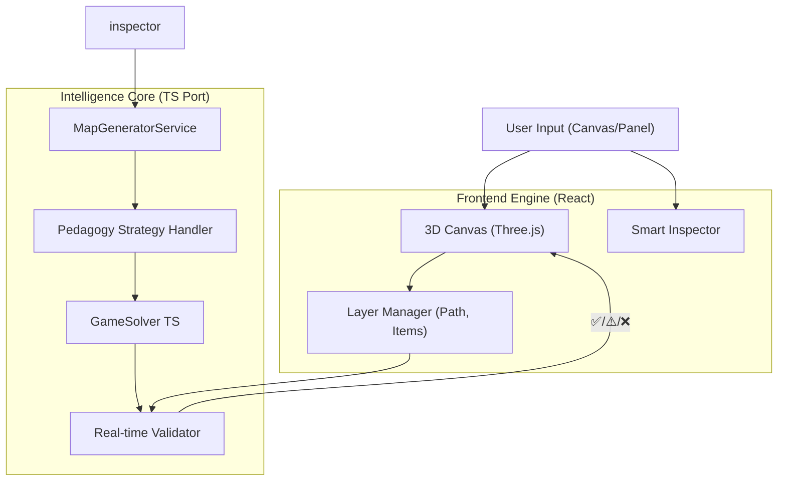

# Design: Intelligent Map Builder

## Context
Refining the integration plan to prioritize "Pedagogy-First" features. We are moving from a simple manual editor to an **Assistive Creation Tool** that guides the user towards valid educational content.

## Goals
1.  **Pedagogy-First**: Every feature supports specific learning objectives (Functions, Loops).
2.  **Visual + Intelligent**: Users draw; System validates and enhances.
3.  **Immediate Feedback**: Real-time validation for solvability and academic compliance.

## Architecture



## detailed System Design

### 1. The Canvas & Layer System
Instead of a flat object list, we implement a **Layer System**:
- **Path Layer**: Defines the topology (walkable cells). Enforces connectivity.
- **Item Layer**: Snaps to Path Layer. Validates via `SemanticPositionHandler`.
- **Solution Layer**: Read-only overlay visualizing the optimal path and step counts.

### 2. The Pedagogy Engine
Ported from Python `src/map_generator`:
- **Strategy Presets**:
    - `Function Reuse`: Forces identical patterns on branches.
    - `While Loop Decreasing`: Sets `density_trend="decreasing"`.
- **Logic**: The engine accepts `IAcademicParams` and outputs `IItemPlacement` suggestions.

### 3. Smart Placement & Validation
- **Auto-Place**: Users select segments -> click "Apply Pattern" -> Engine places items based on `logic_type`.
- **Continuous Validation**:
    - *Debounced (500ms)* check running client-side.
    - Checks: `isSolvable`, `isPedagogyValid` (e.g., "Loop requires >3 repetitions").

## Data Schema Changes

```typescript
// New Academic Config State
interface IMapBuilderState {
  meta: {
    bloom_level: 'APPLY' | 'ANALYZE' | ...;
    target_topic: 'FUNCTIONS' | 'LOOPS';
    difficulty: number; // 0-100
  };
  validation: {
    solvable: boolean;
    pedagogy_warnings: string[];
    integrity_errors: string[];
  };
  layers: {
    path_visible: boolean;
    solution_visible: boolean; // Overlay
  };
}
```
