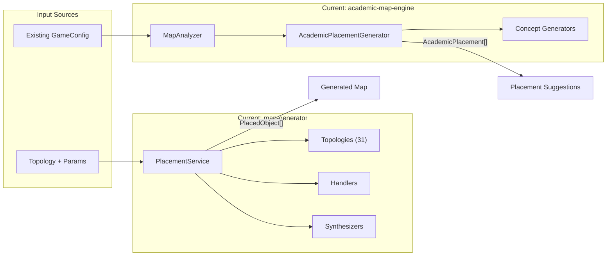

# Design: Package Merge Architecture

## Context

Hai packages xử lý map có vùng chức năng khác nhau nhưng có overlapping code:



## Goals / Non-Goals

### Goals
- ✅ Unified type system (`Coord` tuple everywhere)
- ✅ Clear separation: Generator vs Analyzer
- ✅ Shared utilities extracted to `core/`
- ✅ Single package for all map-related operations
- ✅ No breaking changes for external consumers (after migration)

### Non-Goals
- ❌ Rewrite algorithms (chỉ move và refactor imports)
- ❌ Thêm features mới (scope là merge only)
- ❌ Support cả `Vector3` interface và `Coord` tuple (chọn một)

## Decisions

### Decision 1: Type Unification

| Item | Decision | Rationale |
|------|----------|-----------|
| Coordinate type | `Coord = [number, number, number]` | Tuple nhẹ hơn, dễ serialize, JSON-compatible |
| Direction type | `Direction = Coord` | Alias cho clarity |
| Segment type | Keep `PathSegment` từ academic-map-engine | Có nhiều metadata hơn (plane, direction) |

**Migration path:**
```typescript
// Old (academic-map-engine)
interface Vector3 { x: number; y: number; z: number }

// New
type Coord = [number, number, number];

// Conversion helper
function vector3ToCoord(v: Vector3): Coord {
  return [v.x, v.y, v.z];
}
```

### Decision 2: Module Structure

```
academic-map-generator/
├── src/
│   ├── index.ts                 # Public exports
│   │
│   ├── core/                    # Shared types & utils
│   │   ├── types.ts             # Coord, Segment, PathInfo, etc.
│   │   ├── geometry.ts          # Vector operations
│   │   └── segment-utils.ts     # Segment analysis helpers
│   │
│   ├── generator/               # Map creation (từ map-generator)
│   │   ├── index.ts
│   │   ├── PlacementService.ts
│   │   ├── TopologyRegistry.ts
│   │   ├── topologies/          # 31 topology files
│   │   ├── handlers/            # SolutionFirstPlacer, etc.
│   │   ├── synthesizers/        # FunctionSynthesizer, etc.
│   │   ├── strategies/          # Pedagogical strategies
│   │   └── validation/          # PathVerifier, etc.
│   │
│   └── analyzer/                # Map analysis (từ academic-map-engine)
│       ├── index.ts
│       ├── MapAnalyzer.ts
│       ├── AcademicPlacementGenerator.ts
│       ├── AcademicConceptTypes.ts
│       ├── CoordinatePrioritizer.ts
│       ├── PlacementTemplate.ts
│       ├── SelectableElement.ts
│       └── generators/          # LoopGenerators, etc.
│
├── package.json
├── tsconfig.json
└── README.md
```

### Decision 3: Code Ownership Classification

| Code | Owner | Reasoning |
|------|-------|-----------|
| `segment analysis` | `core/` | Dùng chung bởi cả generator và analyzer |
| `pattern detection` | `core/` | Extract shared logic |
| `topology definitions` | `generator/` | Chỉ generator tạo topology |
| `4-tier analysis pipeline` | `analyzer/` | Chỉ analyzer cần |
| `placement calculation` | `generator/` | Thuộc về quá trình tạo |
| `academic concepts` | `analyzer/` | Thuộc về phân tích học thuật |
| `solution synthesis` | `generator/` | Phần tạo solution |
| `coordinate prioritization` | `analyzer/` | Phục vụ phân tích |

### Decision 4: Import Strategy

All imports sẽ thông qua module index files:

```typescript
// External usage
import { 
  PlacementService, 
  LShapeTopology,
  MapAnalyzer 
} from '@repo/academic-map-generator';

// Or for specific modules
import { PlacementService } from '@repo/academic-map-generator/generator';
import { MapAnalyzer } from '@repo/academic-map-generator/analyzer';
import { Coord, Segment } from '@repo/academic-map-generator/core';
```

## Risks / Trade-offs

### Risk 1: Breaking Changes
- **Impact**: All consumers need to update imports
- **Mitigation**: Provide codemod script or detailed migration guide

### Risk 2: Large PR
- **Impact**: Khó review, risk merge conflicts
- **Mitigation**: Split thành multiple PRs:
  1. Create package structure + copy files
  2. Update types (Vector3 → Coord)
  3. Update imports in consumers
  4. Delete old packages

### Risk 3: Circular Dependencies
- **Impact**: `generator/` và `analyzer/` có thể cần import lẫn nhau
- **Mitigation**: Extract shared code to `core/`, strict dependency rules:
  - `core/` → no internal deps
  - `generator/` → can import `core/`
  - `analyzer/` → can import `core/`, optionally `generator/types`

## Migration Plan

### Step 1: Create New Package (Non-breaking)
1. Create `packages/academic-map-generator`
2. Copy all files from both packages
3. Refactor imports
4. Build succeeds

### Step 2: Update Consumers
1. Update `apps/map-builder-app` imports
2. Test build + runtime

### Step 3: Cleanup
1. Mark old packages as deprecated
2. After verification, delete old packages
3. Remove from workspace

## Open Questions

1. **Q: Keep backward compatibility layer?**
   - Option A: Re-export from old package names (temporary)
   - Option B: Clean break, update all at once
   - **Recommendation**: Option B (small project, can update all)

2. **Q: How to handle `Vector3` vs `Coord` in existing saved map configs?**
   - Map configs use `{ x, y, z }` object format
   - Need to convert at load time
   - **Recommendation**: Add converter in MapAnalyzer

3. **Q: Separate `core/` as its own package?**
   - Could be `@repo/map-core` for other packages
   - **Recommendation**: Keep in same package for now, extract later if needed
